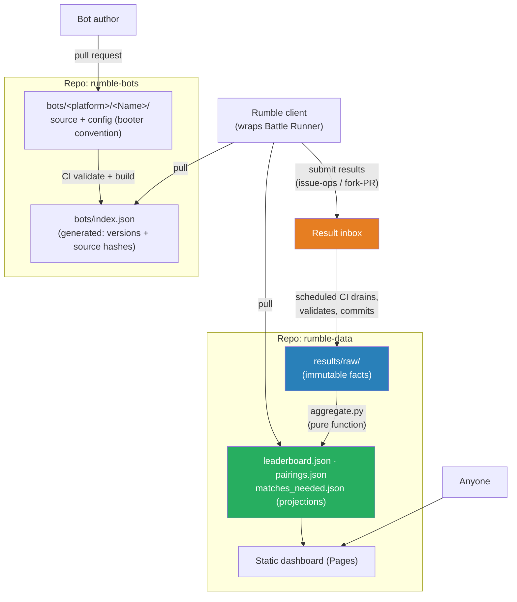

# Tank Royale Rumble - Umbrella Design Document

> **Status: DRAFT** - exploration phase. No decisions have been made. This document and its
> sub-documents exist to understand the details and implications before any ADR or change
> proposal is written.

This is the coordinating umbrella document for the design of an automated, serverless,
decentralized, community-driven tournament system for Robocode Tank Royale. It holds the overall
idea, the design principles, and the map of the detailed design documents. Details live in the
sub-documents; this document should stay short and stable.

## Vision

A continuously running, community-driven league (in the spirit of the classic RoboRumble and
LiteRumble) where:

- Bot authors submit bot **source code** via pull requests.
- Community members run battles on **their own machines** using a small rumble client.
- Results are collected, aggregated into rankings (APS as the primary metric), and published on a
  static dashboard.
- The entire system (bots, results, ranking logic, dashboard) lives **inside Git repositories**,
  with automation provided by the forge's CI (GitHub Actions primarily, portable to GitLab CI and
  Forgejo/Gitea Actions).

## Design Principles

These principles apply to every sub-document. A design that violates one of them needs an explicit,
written justification.

| # | Principle | Meaning |
|---|-----------|---------|
| P1 | **Zero infrastructure cost** | No servers, no paid databases, no cloud functions. Only free-tier forge features (repos, CI, Pages, issues). |
| P2 | **Forkability** | A fork of the repositories plus "enable CI, enable Pages" is a fully functioning rumble. Nothing canonical may live outside Git. |
| P3 | **No secrets** | CI uses only the forge's built-in token. Nothing to rotate, nothing that expires with a person. Clients hold at most a token that can open issues. |
| P4 | **Single writer** | Only CI commits to the data repository. Clients and humans never do. Race conditions are eliminated by construction, not by locking. |
| P5 | **Event sourcing** | Raw match results are immutable, append-only facts. Everything else (leaderboard, pairing stats, match advice) is a derived projection that anyone can recompute locally with one script. |
| P6 | **Advice, not locks** | Matchmaking files tell clients what battles are *useful*, never reserve battles. Duplicate work produces extra samples, which are statistically welcome. |
| P7 | **Portability** | All logic is plain scripts (Python). CI YAML files are thin wrappers. The only forge-specific seam is "how a result payload reaches the validator". |
| P8 | **Bus-factor resilience** | Hosted in an organization with 3+ owners. Governance is a document in the repo. A quarterly "fork drill" verifies P2 actually holds. |

## System Overview

## Repository Topology

Two repositories under a community organization:

| Repo | Contents | Who writes |
|------|----------|-----------|
| `rumble-bots` | Bot source in booter-convention folders, submission policy, validation CI | Community via PR, moderators merge |
| `rumble-data` | Raw results, projections, aggregation scripts, matchmaking output, dashboard | CI only (single writer) |

Rationale for the split: the bots repo has human-speed, review-gated history; the data repo
accumulates thousands of machine commits and needs periodic compaction. Mixing them would make the
bots repo unpleasant to fork and review.

## Design Documents

| Document | Scope | Status |
|----------|-------|--------|
| [Bot Submission and Handling](./bot-submission.md) | How bot source enters the system: PR flow, validation, review, versioning, governance | Draft |
| [Rumble Client: Battles and Result Upload](./client-battles-and-results.md) | The client loop, matchmaking consumption, own-bot priority, result submission, trust model from the client's side | Draft |
| [Result Aggregation and Dashboard](./aggregation-and-dashboard.md) | Ingestion of submitted results, validation and quarantine, ranking math, projection files, static dashboard, operations | Draft |
| [User Documentation and Onboarding](./user-documentation.md) | The document set for bot authors, battle contributors, and moderators; onboarding journeys; friction budget | Draft |

## Building Blocks Already in This Repository

The rumble does not start from scratch. These existing modules are the foundation:

| Module | Role in the rumble |
|--------|--------------------|
| [`runner/`](/runner/README.md) | Battle Runner API: embedded server, bot process management, identity matching by name+version, `BattleResults`, multi-battle reuse. The rumble client is a thin wrapper around this. |
| [`booter/`](/booter/README.md) | Defines the bot directory convention (`<Name>/<Name>.json` + platform boot scripts) that the submission repo adopts unchanged. |
| [`recorder/`](/recorder/README.md) | Produces `.battle.gz` replays, usable as optional result evidence. |
| [`schema/schemas/`](/schema/schemas/) | `results-for-observer` defines the per-participant score fields; the raw result record maps 1:1 onto it. |

## Settled Directions

Not formal decisions (no ADR yet), but directions settled during design review. The umbrella
tracks them so sub-documents stay consistent:

| Direction | Where detailed |
|-----------|----------------|
| **Ruleset and scoring = RoboRumble/LiteRumble, unchanged** (APS primary; Win%, Survival, Vote, NPP/ANPP, KNNPBI, Glicko-2). Battle tested for two decades; do not reinvent. | Aggregation doc |
| **Own-bot priority: yes**, with the self-reported-only marker plus independent confirmation for trust. | Client doc |
| **Engine pinning by `behaviorVersion`.** Release versions stay lockstep across all Tank Royale artifacts (the right model for the product); a separate integer `behaviorVersion`, owned by the server and bumped only on game-observable changes (server physics/scoring/turn processing/RNG plus Bot API behavior), is the compatibility contract. Compatibility, client rollout, and result **epochs** all key on it; releases that do not bump it (e.g. GUI-only) cause no rollout and no epoch reset. Supersedes the earlier patch-vs-minor rule. | Client + aggregation docs |
| **One active version per bot** (version bump supersedes the old one, RoboRumble style), plus a per-owner **bot slot** budget. | Submission doc |
| **Owner (forge account) is distinct from authors (display names)**; ownership drives permissions, slots, bans, and self-report detection. | Submission doc |
| **Banning** of owners/bots via an auditable list; enforced automatically in submission CI and result validation. | Submission + aggregation docs |
| **Practice mode** in the client: free local battles against rumble bots, never submitted; ranked mode auto-submits everything. | Client doc |
| **Replays stay client-side** as read-only evidence, bound to results by `battleId` (UUID) + SHA-256. | Client doc |
| **Batched submissions** from a local journal; clients never touch Git history (no commits, no amends). | Client doc |
| **Runtimes ship in the client container** (JVM, .NET, Python, Node.js + pinned engine), tagged by engine version; install scripts as bare-metal fallback. | Client doc |
| **Forge ToS reviewed**: this usage is a software project, not detached storage; design keeps traffic and repo size deliberately modest. | Aggregation doc |
| **Bot names are bound to their owner** at first merge; only the owner's registered accounts may submit new versions. Owners may register multiple forge accounts; account changes require a PR from an already-registered account. | Submission doc |
| **Official Bot APIs required** for ranked bots (Java, C#, Python, TypeScript); custom frameworks are not eligible. Resolves the dependency allowlist per platform. | Submission doc |
| **Run from source, never call a compiler**: runtimes compile behind the scenes on clients, and CI validates with a source-run smoke boot instead of a build step. | Submission doc |
| **Bot slots: start at 5** active bots per owner; teams deferred (not in v1). | Submission doc |
| **License required per bot**, validated in CI against a small permissive allowlist; missing or wrong license dismisses the PR. | Submission doc |
| **Evidence backups are the user's responsibility**, actively encouraged by the client; replays are never held centrally. | Client doc |
| **Submission at battle boundaries** (a battle = the game type's full round count); container gets a forge-only egress allowlist; journal staleness is bounded by the engine pin. | Client doc |
| **Issue-ops spelled out**: submissions are labeled forge issues carrying a JSON batch envelope, drained and closed by CI; spam is handled by strict format, per-account budgets, and forge-level blocking as last resort. | Aggregation doc |
| **Onboarding PR required from day one** for result submitters: a one-time, moderated registration under `clients/` in the data repo; unregistered submissions are closed unprocessed. | Aggregation doc |
| **GitHub Pages confirmed** for the dashboard; compaction policy settled (monthly rollups to the archive branch after three full months). | Aggregation doc |
| **License allowlist and mechanism settled**: MIT, Apache-2.0, BSD-3-Clause, GPL-3.0-or-later, declared via an SPDX field in the bot config, binding per `CONTRIBUTING.md`, submitter responsibility on the DCO model, notice-and-takedown for bad-faith uploads. | Submission doc |
| **Confusable-name check designed**: UTS #39 skeleton + leetspeak folding + normalization; identical skeleton fails validation, edit distance 1 flags for moderators. | Submission doc |
| **User documentation is a first-class design area**: docs are Markdown in the repos (fork with the system), one quickstart per audience, error messages link into the docs, onboarding friction is budgeted. | User documentation doc |
| **No per-client contribution cap**, matching the classic rumble (verified on the RoboWiki): saturation is handled by the priority mechanism alone; `targetSamplesPerPairing` plays the classic `BATTLESPERBOT` role. | Client + aggregation docs |
| **SPDX `license` field joins the general booter bot config schema** (not rumble-only); implementation lands in the Tank Royale repo when the design leaves draft. | Submission doc |
| **Docs and repos are versioned by the Tank Royale version**: both repos are tagged at every engine pin change; docs always describe the pinned engine, old tags serve old readers. Template bots per platform ship in `rumble-bots`; scoring explanations live in the Rumble FAQ, linked from dashboard column headers. | User documentation doc |

## Cross-Cutting Open Questions

Questions that span more than one sub-document. Per-document questions live in the documents.

1. **Result signing: v1 or deferred?** Client keypairs and signed results add integrity but also
   onboarding friction. Leaning: defer, ship forge-account identity plus outlier detection first
   (the classic RoboRumble trust model, formalized). See the client and aggregation documents.
2. **Game types.** Start with 1v1 only, or 1v1 and melee from day one? Melee multiplies the pairing
   space and the matchmaking math.
3. **Working name.** "Tank Royale Rumble" is used throughout as a placeholder.
4. **Guarding `behaviorVersion` bumps.** The epoch model leans on the behavior version being
   bumped exactly when game-observable behavior changes. The strong guard is a deterministic
   replay regression test in the engine's CI: replay recorded battles and compare outcomes; an
   unintended difference fails the build, an intended one requires bumping `behaviorVersion` in
   the same change. The concrete test design (which battles, how many, where recordings live) is
   open.

## Glossary

| Term | Meaning |
|------|---------|
| APS | Average Percentage Score: a bot's mean, over all its pairings, of its mean score share per pairing. Order-independent, so the leaderboard is a pure function of the result set. |
| Pairing | An unordered pair of bot versions that can meet in battle. |
| Projection | A file derived entirely from the raw results (leaderboard, pairing stats, match advice). Disposable and reproducible. |
| Fact | An immutable raw result record. Never edited, only added. |
| Issue-ops | Using forge issues as a write-free submission inbox, drained by CI. |
| Single writer | The rule that only the aggregation CI commits to `rumble-data`. |
| Owner | The forge account that submitted a bot; drives permissions, slots, bans. Distinct from the display `authors` in the bot config. |
| Behavior version | Server-owned integer bumped only on game-observable changes (physics, scoring, turn processing, RNG, Bot API behavior). The compatibility contract between engine, clients, and results; independent of the lockstep release version. |
| Epoch | The result partition for one `behaviorVersion`. Releases that keep the behavior version stay in the epoch; a bump opens a new one and the ranked table restarts sampling. |
| Practice mode | Client mode for private tuning battles; results are never submitted. Ranked mode auto-submits everything. |
| Journal | The client's local append-only file of ranked results, submitted in batches. |
