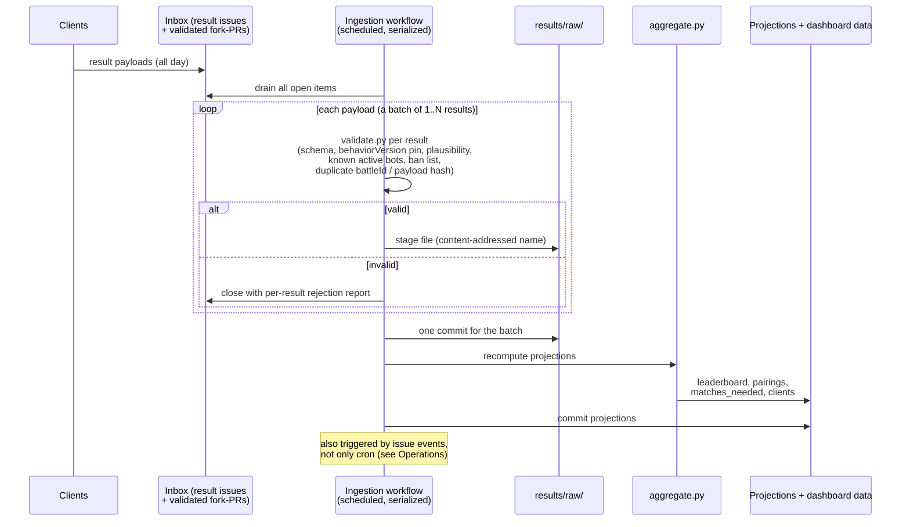
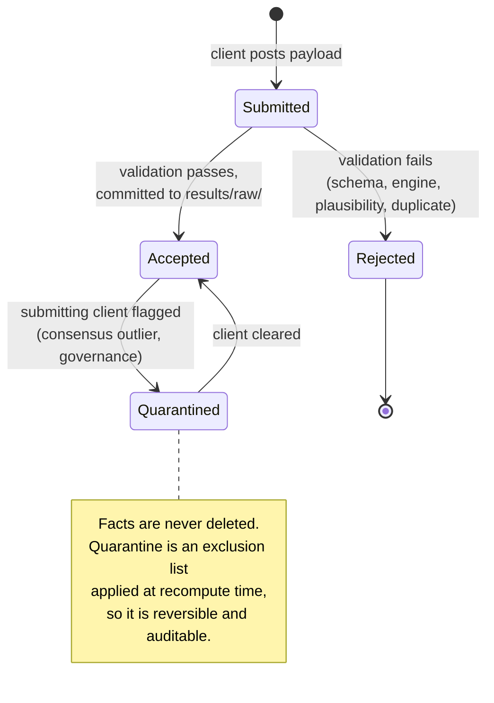

# Rumble Design: Result Aggregation and Dashboard

> **Status: DRAFT** - design direction captured.
> Part of the [Tank Royale Rumble umbrella design](./README.md).

## Scope

The "server" side that is not a server: how submitted results are ingested into the `rumble-data`
repository, validated, aggregated into rankings, and published on a static dashboard. Also covers
operations and resilience. There is no live backend anywhere; everything here is scheduled CI plus
static files (principles P1, P4, P5).

## Repository Layout

```
rumble-data/
├── results/raw/<year>/<month>/*.json    (immutable facts, append-only)
├── leaderboard/leaderboard.json         (projection)
├── leaderboard/bots/<name>-<version>.json  (per-bot detail shards)
├── matchmaking/matches_needed.json      (projection: advice for clients)
├── matchmaking/pairings.json            (projection: per-pairing stats)
├── clients.json                         (projection: per-client stats + flags)
├── engine.json                          (pinned behaviorVersion + release/image)
├── wellknown/rumble.json                (canonical-location pointer)
├── scripts/validate.py                  (payload validation)
├── scripts/aggregate.py                 (facts → all projections, pure function)
└── site/                                (static dashboard, served by Pages)
```

## Ingestion: Single Writer, Batch Drain

Only CI ever commits (P4). Ingestion is a scheduled workflow (every 15-30 minutes) with a CI
concurrency group so runs serialize. It drains the whole inbox in one pass and produces **one
commit**, which eliminates merge conflicts by construction.



### What a submission concretely is (issue-ops made explicit)

"Issue-ops" means: the inbox is the forge's ordinary **issue tracker**, used as a mailbox.
Nothing custom is deployed. On GitHub, a submission from the client looks like this:

- **Issue title**: `[result] flemming-desktop-01 2026-07-02T14:03:22Z` (fixed prefix, client id,
  timestamp).
- **Label**: `result-submission` (lets the drain workflow query exactly the issues it owns).
- **Issue body**: one fenced JSON block containing a **batch envelope**, i.e. the client's
  journal batch:

````markdown
```json
{
  "schemaVersion": 1,
  "clientId": "flemming-desktop-01",
  "clientVersion": "0.3.0",
  "results": [ { ...result record 1... }, { ...result record 2... } ]
}
```
````

- The client creates it with one API call (`gh issue create --label result-submission
  --title ... --body-file batch.json` or the REST equivalent), authenticated as the user's forge
  account with a fine-grained token with Issues write permission limited to this repository.
  GitHub does not expose a narrower create-issue-only permission.
- A GitHub issue body holds ~65k characters, roughly 40-60 result records per issue at our record
  size; the client splits larger journals across issues.
- The drain workflow lists open `result-submission` issues, parses each body, validates each
  result, commits accepted ones, and **closes every processed issue** with a comment listing
  per-result outcomes (accepted / rejected + reason). A closed issue is the client's receipt; the
  issue itself is transport, never storage, so losing issues (e.g. in a fork) loses nothing.

The same pattern works on GitLab (issues + labels) and Forgejo/Gitea (same). The fork-PR
transport carries the identical batch envelope as a file, so `validate.py` has one input format.

### Spam prevention

The inbox is a public issue tracker, so it will eventually receive junk. Layers:

- **Scope**: the drain only ever reads issues carrying the `result-submission` label and the
  strict title prefix; everything else on the tracker is ignored by the pipeline.
- **Strict format**: a body that does not parse as exactly one batch envelope is closed
  immediately with a form-letter comment; nothing is committed. Malformed spam costs one API
  call to close.
- **Registration required (day one)**: results are only accepted from forge accounts that have
  completed a one-time **onboarding PR** to `rumble-data`, adding a small file under
  `clients/<forge-account>.json` (declared client ids, optional public key if signing is ever
  adopted). The PR is reviewed by a moderator like any other, which is exactly the human gate
  that makes throwaway-account spam uneconomical. Submissions from unregistered accounts are
  closed unprocessed with a pointer to the onboarding guide.
- **Per-account limits**: the drain enforces a per-registered-account budget (issues per hour,
  results per day); over-budget submissions are closed unprocessed with a rate-limit notice.
- **Escalation**: a persistently abusive account is added to the ban list (submission document)
  and, as a last resort, blocked at the forge level from the organization; forge-level blocking
  is the one tool that actually stops the API calls themselves.

### Result lifecycle



## Aggregation: A Pure Function

The core invariant (P5): **every projection is a pure function of `results/raw/` plus the
exclusion list.** No projection may depend on ingestion order, wall-clock time (beyond a
"computedAt" stamp), or anything outside the repo. Anyone can run `python scripts/aggregate.py`
locally and reproduce the leaderboard bit-for-bit. This is what makes the rumble auditable and
fork-restartable without permission from anyone.

### Ruleset and scoring: adopt LiteRumble, do not reinvent

**Decision direction: the rumble uses the RoboRumble/LiteRumble ruleset and scoring system
unchanged.** These rules have been battle tested for two decades; the design contribution here is
the delivery mechanism, not new game math.

Battle parameters are frozen in `engine.json` per ranked game type:

| Game type | Rounds | Battlefield | Participants |
|-----------|--------|-------------|--------------|
| `1v1` | 35 | 800 x 600 | 2 bots |
| `twinduel` | 75 | 800 x 800 | 2 teams, 2 bots per team |
| `melee` | 35 | 1000 x 1000 | 10 bots |

These names intentionally follow the popular LiteRumble/RoboRumble categories for the original
game: 1v1, TwinDuel, and Melee. Mini, micro, nano, and giga categories are not part of v1 because
they depend on bytecode-size limits. Tank Royale Rumble distributes source code across multiple
programming languages, so any size-class system needs a separate source-size design per language.

Scoring metrics, matching the LiteRumble columns (all except Glicko-2 are per-pairing statistics
and therefore order-independent):

| Metric | Meaning |
|--------|---------|
| **APS** (primary) | Average Percentage Score: mean over pairings of the mean score share per pairing (formula below) |
| **Win%** | Fraction of pairings won (LiteRumble's replacement for PL, so it does not fluctuate with the number of bots) |
| **Survival** | Survival percentage (`1v1` and `twinduel`: per pairing; `melee`: out of total rounds, per LiteRumble) |
| **Vote** | Percentage of bots that score worst against you ("percentage you are best against") |
| **NPP / ANPP** | (Average) Normalised Percentage Pairs, computed in the batch pass |
| **KNNPBI** | K-Nearest-Neighbours Problem Bot Index, computed in the batch pass |
| **Glicko-2** | Rating for incomplete-pairing robustness; sequence-dependent, so computed as a batch projection with a deterministic ordering rule (timestamp, then payload hash) to stay reproducible |

The APS core:

```
share(bot, battle)   = totalScore(bot) / Σ totalScore(all participants)
APS(bot, pairing)    = mean of share(bot, battle) over that pairing's battles
APS(bot)             = mean of APS(bot, pairing) over all the bot's pairings
```

Averaging per-pairing first means extra samples of one pairing (e.g. from own-bot priority,
see the [client document](./client-battles-and-results.md)) improve precision without skewing
weight. LiteRumble computes the heavier batch metrics (ANPP, NPP, KNNPBI, Vote) twice a day
rather than on every update; the same split applies here (every-drain APS/Win%/Survival, daily
batch for the rest) if full recompute proves slow.

### Ranked pool and result epochs

- The leaderboard ranks only the **latest active version** of each bot (`status: active` in
  `bots/index.json`, see the submission document). Superseded, retired, and disqualified versions
  keep their facts and per-version detail shards but leave the ranked table, exactly like a
  RoboRumble version bump.
- Results are partitioned into **epochs by `behaviorVersion`** (the server-owned integer that
  bumps only on game-observable changes; see the client document's Engine Pinning section). The
  release version is irrelevant here: a GUI-only release, whatever its semver bump, keeps the
  behavior version and therefore the epoch. A `behaviorVersion` bump opens a new epoch: the
  ranked leaderboard is computed from the current epoch only, while old epochs remain browsable
  archives. This is the honest consequence of "mixed game behavior corrupts comparability":
  rather than pretending results across behavior versions are comparable, the rumble restarts
  sampling and lets matchmaking (everything is suddenly under-sampled) rebuild the table
  quickly.

### Matchmaking output

`aggregate.py` also regenerates `matchmaking/matches_needed.json`, closing the loop with clients:

```json
{
  "schemaVersion": 1,
  "generatedAt": "2026-07-02T15:00:00Z",
  "sourceCommit": "abc1234",
  "gameType": "1v1",
  "targetSamplesPerPairing": 6,
  "priorityPairs": [
    { "bots": ["NewBot 1.0", "Raven 2.1"], "have": 0, "reason": "new-bot" },
    { "bots": ["Fire 1.2", "Walls 1.0"], "have": 2, "reason": "under-sampled" },
    { "bots": ["Raven 2.1", "Corners 1.0"], "have": 6, "reason": "unconfirmed-self-reported" }
  ]
}
```

Priority rules, in order: pairings with zero samples (new bots rank fast), pairings below the
sample target, pairings marked **unconfirmed-self-reported** (all samples came from clients owned
by a participant; they stay listed until an independent client contributes, see the client
document's trust section), then oldest-sampled pairings for slow refresh. The file is advice, not
reservation (P6): stale reads and duplicate work are harmless by design.

These rules deliberately mirror the classic RoboRumble server behavior (verified on the
RoboWiki): pairings with fewer than 2 battles are always priority, low-battle-count pairings are
offered with elevated probability thereafter, and the `targetSamplesPerPairing` value plays the
role of the classic `BATTLESPERBOT` threshold. There is **no per-client contribution cap**, same
as the classic rumble; per-pairing averaging makes extra samples harmless.

### Leaderboard projection

```json
{
  "schemaVersion": 1,
  "computedAt": "2026-07-02T15:00:00Z",
  "computedFromCommit": "abc1234",
  "gameType": "1v1",
  "entries": [
    { "bot": "Raven 2.2", "platform": "JVM", "owner": "flemming", "authors": ["..."],
      "aps": 78.42, "winPct": 91.4, "survival": 84.1, "vote": 3.2,
      "anpp": 81.7, "knnpbi": -0.4, "glicko2": 1834,
      "battles": 412, "pairings": 148, "pairingsTotal": 152, "unconfirmedPairings": 2,
      "epoch": 7, "firstSeen": "2026-05-01" }
  ]
}
```

Per-bot detail shards (`leaderboard/bots/<name>-<version>.json`) hold the full per-pairing
breakdown so the main payload stays small and a bot's detail page loads exactly one file.

### Client accountability projection

`clients.json` carries per-client statistics: battles submitted, pairings covered, mean deviation
from consensus on shared pairings, and flags. Moderators use it to decide quarantine; the
dashboard can show a public "contributors" view, which doubles as recognition (another motivation
lever alongside own-bot priority).

## Static Dashboard

Plain `site/index.html` plus vanilla JS on Pages, fetching leaderboard JSON at runtime. No build
step: the aggregator already produced the JSON, so the "site generator" is nothing. Client-side
sort/search over a few hundred rows per game type is trivial. A bot or team row links to its
detail shard. Pages exists on GitHub, GitLab, and Codeberg, and since the site is static files
reading sibling JSON, it also works from any web server or locally from a checkout.

## Forge Terms of Service

Is storing results in a repo and running the pipeline on CI a misuse of GitHub? Assessment: **no,
at this scale and shape**, but the design should stay deliberately inside the spirit of the terms:

- GitHub's Acceptable Use Policies restrict using the service as generic data/file storage or a
  CDN **detached from a software project**, and disallow activity that places disproportionate
  burden on infrastructure. GitHub Actions terms similarly expect workflows to relate to the
  software project (their canonical negative example is crypto mining, not automation of an open
  source project's own data).
- This system is the opposite of detached storage: the results, scripts, and dashboard **are** the
  open source project. Small text JSON at ~50 battles/day is negligible next to ordinary CI
  artifacts, and "git scraping" repos with scheduled data-collecting workflows are a widespread,
  accepted pattern.
- Design choices that keep it that way, now load-bearing rather than incidental:
  - **Replays stay client-side** (client document): no binary growth, no storage-service smell.
  - **Batched submissions and batch drains**: bounded issue/API traffic and one commit per drain
    instead of thousands of micro-commits.
  - **Compaction to an archive branch**: the working repo stays small (GitHub recommends staying
    well under a few GB; this design stays under megabytes per year of text).
  - **Modest CI cadence** (drains every 15-30 minutes, heavy batch metrics daily), far below any
    fair-use threshold for a public repo.
- The same reasoning holds for GitLab and Forgejo/Codeberg (Codeberg is the strictest about
  non-project storage; a rumble is clearly a project). If a forge ever objects, principle P7 makes
  relocation a config change plus the `wellknown/rumble.json` pointer.

## Operations and Resilience

| Concern | Design answer |
|---------|--------------|
| GitHub disables cron workflows after ~60 days of repo inactivity | Ingestion is *also* triggered by issue events, so any submission wakes the pipeline. Steady-state ingestion commits count as activity. Re-enablement is one line in the runbook. |
| Data growth (~50 battles/day ≈ 18k small files/year) | Fine for Git. **Compaction policy (settled)**: on the first drain of each month, raw result files older than three full months are squashed into one rollup JSON per month and moved to the orphan `archive` branch (which forks, unlike release assets). The working branch therefore carries at most ~4 months of individual files; `aggregate.py` reads raw + rollups and produces identical output either way (pure-function invariant). The published Pages site serves only projections (kilobytes), keeping it orders of magnitude under the ~1 GB Pages cap. |
| Repo moves / project forked | `wellknown/rumble.json`: `{ "canonical": "...", "movedTo": null }`. Clients follow `movedTo` automatically. Migration is one commit plus an announcement. |
| Maintainer unavailable | No secrets anywhere (P3): workflows use only the built-in CI token. Org with 3+ owners. `GOVERNANCE.md` and the runbook live in the repo. Quarterly fork drill verifies P2. |
| Forge migration | All logic in `scripts/*.py`; CI YAML is a thin wrapper. Forgejo Actions is GitHub-Actions-compatible; a GitLab CI wrapper is a page of YAML. The single seam: how a payload reaches `validate.py`. |
| Disputed leaderboard | Anyone recomputes locally from facts. Quarantine is a reviewable exclusion list, not deletion, so every governance action is auditable in Git history. |
| Rejected payloads | Keep a 30-day `rejected/` log on the archive branch, then prune. |
| Aggregation cadence | Full recompute on every drain is the preferred model. Prototype `aggregate.py` early and measure whether it holds at the expected scale or whether the LiteRumble-style split (light metrics per drain, heavy batch metrics daily) is needed from launch. |
