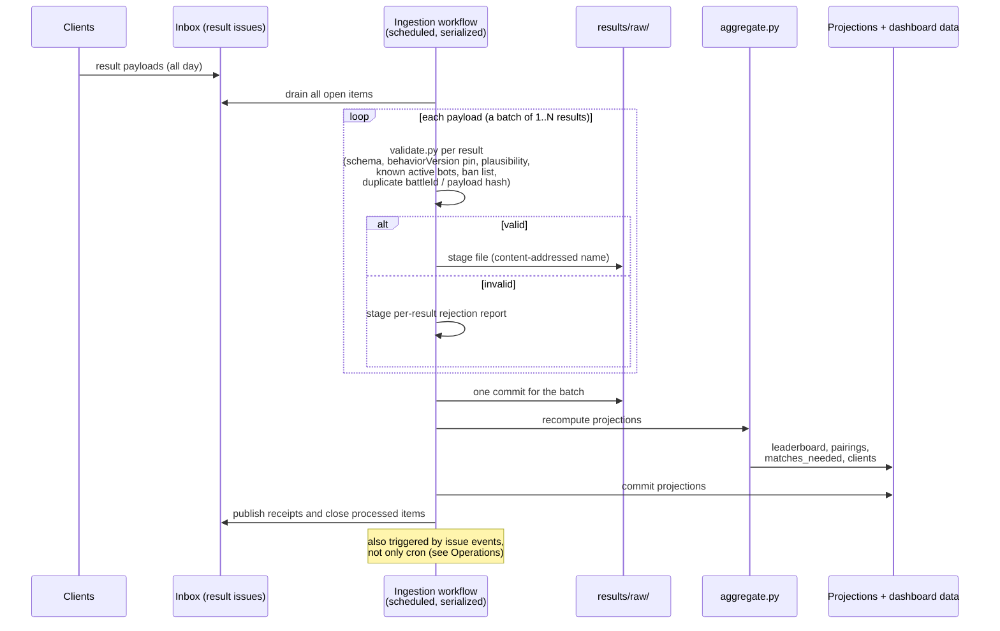
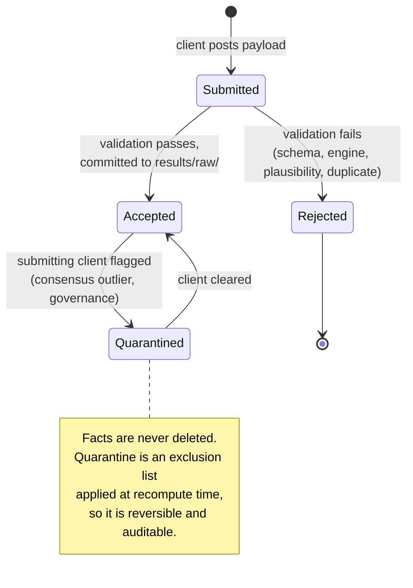

# Rumble Design: Result Aggregation and Dashboard

> **Status: DRAFT** - design direction captured.
> Part of the [Tank Royale Rumble umbrella design](./README.md).

## Scope

The "server" side that is not a server: how submitted results are ingested into the `rumble-data` repository, validated, aggregated into rankings, and published on a static dashboard. Also covers operations and resilience. There is no live backend anywhere; everything here is scheduled CI plus static files (principles P1, P4, P5).

## Repository Layout

```
rumble-data/
├── results/raw/<year>/<month>/*.json       (immutable facts, append-only)
├── results/rollups/*.json                  (compacted immutable facts)
├── leaderboard/<game-type>.json            (current projections)
├── leaderboard/bots/<name>-<version>.json  (per-bot detail shards)
├── matchmaking/{pairings,matches_needed}-<game-type>.json
├── clients.json                            (per-client battle totals)
├── engine.json                             (pinned behaviorVersion + settings)
├── scripts/aggregate.py                    (deterministic current projections)
├── scripts/publication.py                  (freshness + month rollover)
└── site/data/snapshots/<year>-<month>/     (immutable published history)
```

## Ingestion: Single Writer, Batch Drain

Only CI ever commits (P4). Ingestion is a scheduled workflow (every 15-30 minutes) with a CI concurrency group so runs serialize. It drains the whole inbox in one pass and produces **one commit**, which eliminates merge conflicts by construction.


```mermaid
sequenceDiagram
    participant Cl as Clients
    participant Ib as Inbox (result issues)
    participant CI as Ingestion workflow<br/>(scheduled, serialized)
    participant Raw as results/raw/
    participant Agg as aggregate.py
    participant P as Projections + dashboard data

    Cl->>Ib: result payloads (all day)
    CI->>Ib: drain all open items
    loop each payload (a batch of 1..N results)
        CI->>CI: validate.py per result<br/>(schema, behaviorVersion pin, plausibility,<br/>known active bots, ban list,<br/>duplicate battleId / payload hash)
        alt valid
            CI->>Raw: stage file (content-addressed name)
        else invalid
            CI->>CI: stage per-result rejection report
        end
    end
    CI->>Raw: one commit for the batch
    CI->>Agg: recompute projections
    Agg->>P: leaderboard, pairings,<br/>matches_needed, clients
    CI->>P: commit projections
    CI->>Ib: publish receipts and close processed items
    Note over CI: also triggered by issue events,<br/>not only cron (see Operations)
```

### What a submission concretely is (issue-ops made explicit)

"Issue-ops" means: the inbox is the forge's ordinary **issue tracker**, used as a mailbox. Nothing custom is deployed. On GitHub, a submission from the client looks like this:

- **Issue title**: `[result] flemming-desktop-01 2026-07-02T14:03:22Z` (fixed prefix, client id, timestamp).
- **Label**: `result-submission` (lets the drain workflow query exactly the issues it owns).
- **Issue body**: one fenced JSON block containing a **batch envelope**, i.e. the client's journal batch:

````markdown
```json
{
  "schemaVersion": 1,
  "clientId": "flemming-desktop-01",
  "clientVersion": "0.3.0",
  "results": [ { ...result record 1... }, { ...result record 2... } ]
}
```
````

- The client creates it with one API call (`gh issue create --label result-submission --title ... --body-file batch.json` or the REST equivalent), authenticated as the user's forge account with a fine-grained token with Issues write permission limited to this repository. GitHub does not expose a narrower create-issue-only permission.
- A GitHub issue body holds ~65k characters, roughly 40-60 result records per issue at our record size; the client splits larger journals across issues.
- The drain workflow lists open `result-submission` issues, parses each body, validates each result, commits and pushes accepted ones, and only then **closes every processed issue** with a comment listing per-result outcomes (accepted / rejected + reason). Each successful receipt is therefore published after its fact. Retrying an identical retained result returns the same successful outcome, so receipt-delivery failure is safe. The issue itself is transport, never storage, so losing issues (e.g. in a fork) loses nothing after accepted facts are published.

The same pattern works on GitLab (issues + labels) and Forgejo/Gitea (same). A future fork-PR transport can carry the identical batch envelope as a file, but it is unavailable until the result-data capability implements and validates that path.

### Spam prevention

The inbox is a public issue tracker, so it will eventually receive junk. Layers:

- **Scope**: the drain only ever reads issues carrying the `result-submission` label and the strict title prefix; everything else on the tracker is ignored by the pipeline.
- **Strict format**: a body that does not parse as exactly one batch envelope is closed immediately with a form-letter comment; nothing is committed. Malformed spam costs one API call to close.
- **Registration required (day one)**: results are only accepted from forge accounts that have completed a one-time **onboarding PR** to `rumble-data`, adding a small file under `clients/<forge-account>.json` (declared client ids, optional public key if signing is ever adopted). The PR is reviewed by a moderator like any other, which is exactly the human gate that makes throwaway-account spam uneconomical. Submissions from unregistered accounts are closed unprocessed with a pointer to the onboarding guide.
- **Per-account limits**: the drain enforces a per-registered-account budget (issues per hour, results per day); over-budget submissions are closed unprocessed with a rate-limit notice.
- **Escalation**: a persistently abusive account is added to the ban list (submission document) and, as a last resort, blocked at the forge level from the organization; forge-level blocking is the one tool that actually stops the API calls themselves.

### Result lifecycle


```mermaid
stateDiagram-v2
    [*] --> Submitted: client posts payload
    Submitted --> Rejected: validation fails<br/>(schema, engine, plausibility, duplicate)
    Submitted --> Accepted: validation passes,<br/>committed to results/raw/
    Accepted --> Quarantined: submitting client flagged<br/>(consensus outlier, governance)
    Quarantined --> Accepted: client cleared
    note right of Quarantined
        Facts are never deleted.
        Quarantine is an exclusion list
        applied at recompute time,
        so it is reversible and auditable.
    end note
    Rejected --> [*]
```

## Aggregation: A Pure Function

The core invariant (P5): every current projection is a pure function of raw facts and rollups plus the repository-tracked catalog, behavior version, registrations, bans, disqualifications, and exclusions. Aggregation owns no clock. Anyone can run `python scripts/aggregate.py --root .` locally and reproduce the current leaderboard bit for bit. Operational freshness and immutable publication history are maintained separately by `publication.py`.

### Current scoring contract

Tank Royale Rumble adopts the proven RoboRumble/LiteRumble principle of averaging by distinct pairing, while publishing only the metrics the current `rumble-data` implementation actually derives.

Battle parameters are frozen in `engine.json` per ranked game type:

| Game type | Rounds | Battlefield | Participants |
|-----------|--------|-------------|--------------|
| `1v1` | 35 | 800 x 600 | 2 bots |
| `twinduel` | 75 | 800 x 800 | 2 teams, 2 bots per team |
| `melee` | 35 | 1000 x 1000 | 10 bots |

These names intentionally follow the popular LiteRumble/RoboRumble categories for the original game: 1v1, TwinDuel, and Melee. Mini, micro, nano, and giga categories are not part of v1 because they depend on bytecode-size limits. Tank Royale Rumble distributes source code across multiple programming languages, so any size-class system needs a separate source-size design per language.

Current leaderboard columns are:

| Metric | Meaning |
|--------|---------|
| **APS** | Average Percentage Score: mean over distinct pairings of the mean battle score share within each pairing |
| **Battles** | Accepted eligible battle samples contributing to the entry |
| **Pairings** | Exact distinct participant sets contributing to the entry |

The APS core:

```
share(bot, battle)   = totalScore(bot) / Σ totalScore(all participants)
APS(bot, pairing)    = mean of share(bot, battle) over that pairing's battles
APS(bot)             = mean of APS(bot, pairing) over all the bot's pairings
```

A zero battle-total produces zero shares. Averaging per pairing first means extra samples of one pairing (for example, from own-bot priority in the [client document](./client-battles-and-results.md)) improve precision without skewing weight. APS is stored to four decimal places, displayed to two, and sorted descending with exact identity as the stable tie-break. Win%, Survival, Vote, NPP/ANPP, KNNPBI, and Glicko-2 are not current Tank Royale Rumble outputs; adding one would require a separate accepted contract and implementation.

### Ranked pool and result epochs

- The leaderboard ranks only the **latest active version** of each bot (`status: active` in `bots/index.json`, see the submission document). A matchup contributes only while every participant's exact identity is active and game-type eligible. A new version starts with no samples; matchups containing its superseded predecessor stop affecting every participant's current APS. Accepted facts and already published month snapshots remain immutable.
- Results are partitioned into **epochs by `behaviorVersion`** (the server-owned integer that bumps only on game-observable changes; see the client document's Engine Pinning section). The release version is irrelevant here: a GUI-only release, whatever its semver bump, keeps the behavior version and therefore the epoch. A `behaviorVersion` bump opens a new epoch: the ranked leaderboard is computed from the current epoch only, while old epochs remain browsable archives. This is the honest consequence of "mixed game behavior corrupts comparability": rather than pretending results across behavior versions are comparable, the rumble restarts sampling and lets matchmaking (everything is suddenly under-sampled) rebuild the table quickly.

Before accepting a fact or emitting matchmaking advice, `rumble-data` resolves every entry against the synchronized catalog. `1v1` and `melee` use only distinct active individual entries. TwinDuel uses only pairs of distinct active team entries whose immutable `teamMembers` each resolve to active individuals, expand to the pin's participant count, and are disjoint across the two teams. Any result or proposed pairing that does not meet its game type's eligibility is rejected or omitted, respectively.

### Matchmaking output

`aggregate.py` also regenerates `matchmaking/matches_needed.json`, closing the loop with clients:

```json
{
  "schemaVersion": 1,
  "generatedAt": "2026-07-02T15:00:00Z",
  "sourceCommit": "abc1234",
  "gameType": "1v1",
  "targetSamplesPerPairing": 6,
  "priorityPairs": [
    { "bots": ["NewBot 1.0", "Raven 2.1"], "have": 0, "reason": "new-bot" },
    { "bots": ["Fire 1.2", "Walls 1.0"], "have": 2, "reason": "under-sampled" },
    { "bots": ["Raven 2.1", "Corners 1.0"], "have": 6, "reason": "unconfirmed-self-reported" }
  ]
}
```

Priority rules, in order: pairings with zero samples (new bots rank fast), pairings below the sample target, pairings marked **unconfirmed-self-reported** (all samples came from clients owned by a participant; they stay listed until an independent client contributes, see the client document's trust section), then oldest-sampled pairings for slow refresh. The file is advice, not reservation (P6): stale reads and duplicate work are harmless by design.

These rules deliberately mirror the classic RoboRumble server behavior (verified on the RoboWiki): pairings with fewer than 2 battles are always priority, low-battle-count pairings are offered with elevated probability thereafter, and the `targetSamplesPerPairing` value plays the role of the classic `BATTLESPERBOT` threshold. There is **no per-client contribution cap**, same as the classic rumble; per-pairing averaging makes extra samples harmless.

### Leaderboard projection

```json
{
  "schemaVersion": 1,
  "gameType": "1v1",
  "behaviorVersion": 7,
  "projectionId": "sha256-derived-id",
  "entries": [
    { "bot": "Raven 2.2", "name": "Raven", "version": "2.2", "platform": "JVM", "owner": "flemming", "aps": 78.42, "battles": 412, "pairings": 148, "epoch": 7 }
  ]
}
```

Per-bot detail shards (`leaderboard/bots/<name>-<version>.json`) hold the full per-pairing breakdown so the main payload stays small and a bot's detail page loads exactly one file.

### Client accountability projection

`clients.json` currently carries accepted battle totals by client ID. More elaborate trust or contributor statistics remain future design work rather than current dashboard behavior.

## Publication freshness and monthly history

The result and catalog workflows share one non-cancelling writer concurrency group. Before either reads new external input, `publication.py` checks the UTC month. The first writer after a boundary copies current leaderboard and bot-detail JSON byte for byte into `site/data/snapshots/YYYY-MM/`, adds the month to `site/data/history.json`, and refuses to change an existing snapshot. Multiple missed months receive the same last published cumulative state. The live ranking remains cumulative and does not reset.

The history manifest records a hash of the complete current ranking-visible tree. `lastUpdatedAt` advances only when that hash changes, including after a moderation pull request regenerated data outside the publisher. Polls, identical aggregation, snapshot creation, and deployment alone do not advance it.

## Static Dashboard

Plain `site/index.html` plus vanilla JavaScript on Pages fetches leaderboard JSON at runtime. The Ranking period selector uses `site/data/history.json` to choose current data or an immutable month prefix, labels archives read-only, and shows the selected ranking's update time. A bot or team row links to the corresponding detail shard. Changed writer commits explicitly dispatch Pages because pushes made with the built-in Actions token do not trigger another workflow; an hourly scheduled comparison deploys only when the current `site/` tree differs from the latest successful Pages run.

## Forge Terms of Service

Is storing results in a repo and running the pipeline on CI a misuse of GitHub? Assessment: **no, at this scale and shape**, but the design should stay deliberately inside the spirit of the terms:

- GitHub's Acceptable Use Policies restrict using the service as generic data/file storage or a CDN **detached from a software project**, and disallow activity that places disproportionate burden on infrastructure. GitHub Actions terms similarly expect workflows to relate to the software project (their canonical negative example is crypto mining, not automation of an open source project's own data).
- This system is the opposite of detached storage: the results, scripts, and dashboard **are** the open source project. Small text JSON at ~50 battles/day is negligible next to ordinary CI artifacts, and "git scraping" repos with scheduled data-collecting workflows are a widespread, accepted pattern.
- Design choices that keep it that way, now load-bearing rather than incidental:
  - **Replays stay client-side** (client document): no binary growth, no storage-service smell.
  - **Batched submissions and batch drains**: bounded issue/API traffic and one commit per drain instead of thousands of micro-commits.
  - **Compaction to an archive branch**: the working repo stays small (GitHub recommends staying well under a few GB; this design stays under megabytes per year of text).
  - **Modest CI cadence** (drains every 15-30 minutes, heavy batch metrics daily), far below any fair-use threshold for a public repo.
- The same reasoning holds for GitLab and Forgejo/Codeberg (Codeberg is the strictest about non-project storage; a rumble is clearly a project). If a forge ever objects, principle P7 makes relocation a config change plus the `wellknown/rumble.json` pointer.

## Operations and Resilience

| Concern | Design answer |
|---------|--------------|
| GitHub disables cron workflows after ~60 days of repo inactivity | Ingestion is *also* triggered by issue events, so any submission wakes the pipeline. Steady-state ingestion commits count as activity. Re-enablement is one line in the runbook. |
| Data growth (~50 battles/day ≈ 18k small files/year) | Fine for Git. **Compaction policy (settled)**: on the first drain of each month, raw result files older than three full months are squashed into one rollup JSON per month and moved to the orphan `archive` branch (which forks, unlike release assets). The working branch therefore carries at most ~4 months of individual files; `aggregate.py` reads raw + rollups and produces identical output either way (pure-function invariant). The published Pages site serves only projections (kilobytes), keeping it orders of magnitude under the ~1 GB Pages cap. |
| Repo moves / project forked | `wellknown/rumble.json`: `{ "canonical": "...", "movedTo": null }`. Clients follow `movedTo` automatically. Migration is one commit plus an announcement. |
| Maintainer unavailable | No secrets anywhere (P3): workflows use only the built-in CI token. Org with 3+ owners. `GOVERNANCE.md` and the runbook live in the repo. Quarterly fork drill verifies P2. |
| Forge migration | All logic in `scripts/*.py`; CI YAML is a thin wrapper. Forgejo Actions is GitHub-Actions-compatible; a GitLab CI wrapper is a page of YAML. The single seam: how a payload reaches `validate.py`. |
| Disputed leaderboard | Anyone recomputes locally from facts. Quarantine is a reviewable exclusion list, not deletion, so every governance action is auditable in Git history. |
| Rejected payloads | Keep a 30-day `rejected/` log on the archive branch, then prune. |
| Aggregation cadence | Result drains regenerate current projections; catalog checks skip aggregation entirely when normalized content is unchanged. Full recomputation remains fast enough for the current data set. |
