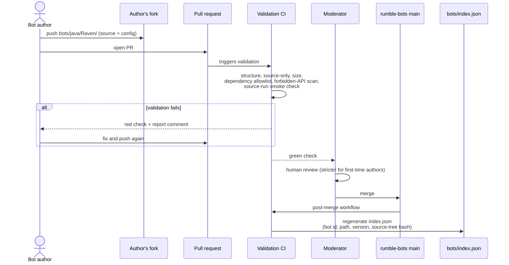
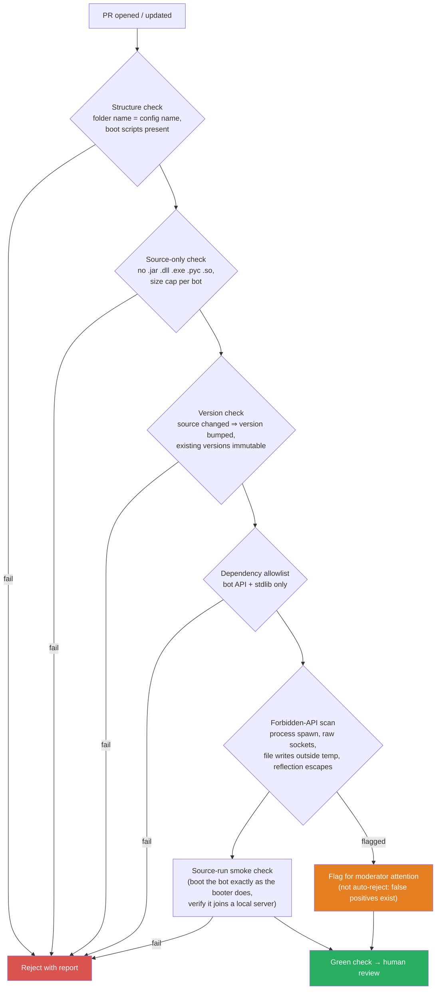

# Rumble Design: Bot Submission and Handling

> **Status: DRAFT** - exploration phase, no decisions made.
> Part of the [Tank Royale Rumble umbrella design](./README.md).

## Scope

How bot source code enters the rumble, is validated, reviewed, versioned, and published to
clients. Covers the `rumble-bots` repository. Running the bots is out of scope (see the
[client document](./client-battles-and-results.md)); ranking is out of scope (see the
[aggregation document](./aggregation-and-dashboard.md)).

## Repository Layout

The submission repo adopts the existing booter directory convention unchanged, so any submitted
bot is bootable by the standard tooling with zero translation:

```
rumble-bots/
├── bots/
│   ├── java/
│   │   └── Raven/
│   │       ├── Raven.json        (booter config: name, version, authors, platform, ...)
│   │       ├── Raven.cmd         (Windows boot script)
│   │       ├── Raven.sh          (Linux/macOS boot script)
│   │       └── src/...           (source only)
│   ├── csharp/...
│   ├── python/...
│   └── typescript/...
├── bots/index.json               (generated by CI, never hand-edited)
├── GOVERNANCE.md                 (moderation policy, lives in the repo so it forks)
└── scripts/validate_bot.py       (the validation logic CI runs; also runnable locally)
```

## Submission Flow



## Validation Pipeline

All checks are one script (`validate_bot.py`) so contributors can run it locally before opening
the PR, and so the pipeline is forge-portable (P7).



### Official Bot APIs required

Ranked bots **must be built on the official Tank Royale Bot APIs** (Java, C#, Python,
TypeScript). Custom frameworks or hand-rolled protocol implementations are not eligible for the
ranked rumble. This is primarily a review-tractability rule: moderators reviewing 50-200 bots can
rely on all game interaction going through one known, audited surface, so review focuses on the
bot's logic rather than re-auditing protocol plumbing per bot. It also resolves the dependency
allowlist per platform: the official bot API package plus the standard library, nothing else
(for TypeScript: the official npm bot API package with a committed lockfile).

### Run from source, never call a compiler

Bots run **directly from source** everywhere, using each runtime's own source-run mechanism,
exactly as the sample bots and booter already do: `java <file>.java` (single-file source launch),
`dotnet run`, `python`, and the recommended TypeScript source runner. No step in the rumble,
client or CI, invokes a compiler explicitly; any compilation happens behind the scenes inside the
runtime.

Consequently, CI validation does not "build" either: the smoke check **boots the bot exactly the
way the booter will** (same boot script, same source-run mechanism) against a throwaway local
server and verifies it connects and completes a handshake within a timeout. What is validated is
what will actually run on clients, and there is no separate build pipeline to maintain or drift.

Forbidden-API scan, per platform (grep-level, deterministic; an advisory AI review can be layered
on top but is never the gate):

| Platform | Examples of flagged constructs |
|----------|-------------------------------|
| Java | `ProcessBuilder`, `Runtime.exec`, `java.net` beyond the bot API's WebSocket, `sun.misc.Unsafe`, reflection on the bot API internals |
| C# | `System.Diagnostics.Process`, P/Invoke (`DllImport`), `Registry`, raw sockets |
| Python | `subprocess`, `os.system`, `socket`, `ctypes`, `importlib` tricks |
| TypeScript | `child_process`, raw `net`/`http` clients, `eval`, native addons |

## Ownership, Versioning, and Identity

### Owner vs. authors

Two distinct concepts that must never be conflated:

- **Owner**: the person behind the bot, identified by their forge account(s). Established
  automatically by CI from the PR metadata at first merge, so it cannot be spoofed in the bot
  config. Ownership drives everything governance-related: who may bump the bot's version, whose
  bot slots it counts against, who a ban applies to, and whose client counts as "self" for the
  self-report marker (client document). An owner may register more than one forge account (see
  below).
- **Authors** (`authors` in the booter config): free-text display names shown on the dashboard
  (the original bot creator may not be the submitter, e.g. classic ports). Decorative only; never
  used for authorization.

### Bot names are bound to their owner

The first merged PR for a bot name **reserves that name for the submitting owner**, globally.
From then on, validation CI rejects any PR that adds a version of an existing bot name unless the
PR author is one of the owner's registered accounts. Without this rule, anyone could upload a
"new version" of someone else's bot and ruin its results and its owner's standing; with it, name
takeover is structurally impossible rather than a moderation catch.

If a newcomer's bot name is already taken, the validation failure says so and the newcomer
renames the bot; first-merged-wins, with moderator judgment for bad-faith cases (see name
squatting under Governance).

### Owners can have multiple forge accounts

People switch or lose accounts (job accounts, forge migration), so an owner is a small record
with one or more forge accounts, kept in a generated `owners.json`:

```json
{
  "schemaVersion": 1,
  "owners": [
    {
      "ownerId": "flemming",
      "accounts": ["flemming-n-larsen", "fnl-work"],
      "bots": ["Raven"],
      "activeSlots": 1
    }
  ]
}
```

- Any registered account may submit version bumps for the owner's bots; slots and bans apply to
  the owner record as a whole, not per account (no ban evasion or slot doubling via extra
  accounts).
- **Adding or removing an account** is a PR to the owner record that must be authored by an
  already-registered account. That authorship is the proof of control; no other identity
  verification is needed.
- **Lost access** (the only registered account is gone) falls back to moderator adjudication via
  `GOVERNANCE.md`; there is deliberately no automated recovery path to social-engineer.

### Version policy: one active version per bot

- A bot's identity in battle is `name` + `version` from its booter config, matching how the
  Battle Runner matches bots.
- **Published versions are immutable.** Changing source requires a version bump. CI enforces this
  by comparing the source-tree hash against `index.json`.
- **Only the latest version of a bot is active.** Merging version `2.2` automatically flips `2.1`
  to `superseded`: it leaves matchmaking and the ranked leaderboard immediately, exactly like a
  RoboRumble version bump. Its results remain facts (history and per-version stats stay
  browsable), but the ranked pool always contains at most one version per bot. This keeps the
  pairing space linear in the number of bots, not versions.
- Old versions' source stays in Git history; the working tree only carries the latest version of
  each bot.

### Bot slots per owner

Each owner has a budget of **X active bots** (exact number to be decided; slots, not submissions).
Version bumps are free (the new version replaces the old in the same slot); a new bot name
consumes a slot; retiring a bot frees one. This bounds review load and the quadratic growth of
the pairing space, and makes "flooding the rumble" structurally impossible rather than a
moderation judgment call.

### The generated catalog

`bots/index.json` (generated, never hand-edited) is the machine-readable catalog clients consume:

```json
{
  "schemaVersion": 1,
  "generatedAt": "2026-07-02T15:00:00Z",
  "commit": "abc1234",
  "bots": [
    {
      "name": "Raven",
      "version": "2.2",
      "platform": "JVM",
      "path": "bots/java/Raven",
      "sourceHash": "sha256:a1b2c3...",
      "owner": "flemming",
      "authors": ["Display Name"],
      "addedAt": "2026-05-01",
      "status": "active"
    }
  ]
}
```

`status` supports lifecycle without deleting history: `active`, `superseded` (newer version
exists), `retired` (owner withdrew it), `disqualified` (governance decision). Everything except
`active` is excluded from matchmaking; past results remain valid facts.

## Governance

- A `moderators` team (3+ people) owns merge rights via CODEOWNERS; one approval required.
- First-time owners: strict review of the whole submission.
- Established owners: after N clean submissions, a `trusted` label enables auto-merge on green CI
  for version bumps of their own bots. New bots always get human review.
- Disputes, disqualification, and moderator rotation are described in `GOVERNANCE.md` inside the
  repo, so policy forks together with the code (P2, P8).

### Banning

Banning is a governance action against an **owner** (forge account) and/or individual bots,
recorded in a reviewable file so every ban is auditable in Git history:

```json
{
  "schemaVersion": 1,
  "bannedOwners": [
    { "account": "some-account", "since": "2026-06-01", "reason": "...", "until": null }
  ],
  "disqualifiedBots": [
    { "bot": "CheatBot 1.0", "since": "2026-06-01", "reason": "..." }
  ]
}
```

Enforcement, all automatic:

- **Submissions**: validation CI checks the PR author against `bannedOwners` and fails the check
  with the reason; moderators close the PR. New submissions from a banned owner are never merged.
- **Existing bots**: banning an owner flips all their bots to `disqualified` in `index.json`, so
  they leave matchmaking on the clients' next sync.
- **Results**: the aggregation side quarantines results submitted by the banned account and, per
  the pure-function recompute, the leaderboard heals on the next run (aggregation document).
- Bans can be temporary (`until`) or permanent; appeals go through `GOVERNANCE.md`. Facts are
  never deleted, so lifting a ban restores everything by recompute.

## Security Analysis (Honest Limits)

Without central sandbox infrastructure, review cannot make untrusted code safe; it makes it
**reviewable, reproducible, and contained**:

- Source-only + dependency allowlist removes most supply-chain and exfiltration surface and keeps
  review tractable at 50-200 bots.
- The source-tree hash in `index.json` guarantees that what clients run is exactly what was
  reviewed (clients run the sources from the pinned commit, so the hash covers precisely what
  executes).
- Actual containment happens on the client via the recommended sandbox container, described in the
  [client document](./client-battles-and-results.md#sandboxing). This split of responsibility
  (review reduces malice, the container contains it) should be stated plainly in contributor docs.

## Licensing

**A license is required for every bot; it cannot be implicit.** Without an explicit license,
forks cannot legally carry the bots along, which breaks principle P2 for the most valuable
content in the system. (Assessment below is engineering-grade reasoning about common licensing
practice, not legal advice.)

- **Mechanism: an SPDX identifier field in the bot config JSON** (e.g. `"license": "MIT"`).
  A machine-readable SPDX declaration by the copyright holder is a widely used and accepted way
  to state a license (the Linux kernel replaced per-file license boilerplate with
  `SPDX-License-Identifier` tags). To make it unambiguous, the repository's `CONTRIBUTING.md`
  states explicitly: *the `license` field in a bot's config constitutes the license grant for
  everything in that bot's directory.* A full `LICENSE` file in the bot directory is welcome but
  optional. Validation CI requires the field, checks it against the allowlist, and dismisses the
  PR with a clear error when it is missing or not allowed.
- **Allowlist: `MIT`, `Apache-2.0`, `BSD-3-Clause`, `GPL-3.0-or-later`.** GPL-3.0 is acceptable
  here precisely because the rumble is **source-only**: the GPL's core demand is that
  distribution includes source, and the repo cannot distribute a bot any other way. Forks carry
  the sources along and therefore stay compliant automatically. The one practical caveat is
  cross-bot code copying: code from a GPL bot must not be pasted into an MIT/Apache bot, which is
  the submitting owner's responsibility like any other copyright question.
- **Responsibility sits with the submitter (DCO model).** Submitting a PR certifies that the
  submitter has the right to publish the code under the declared license, stated in
  `CONTRIBUTING.md` in the style of the Developer Certificate of Origin used across open source.
  So yes: an owner who uploads their own bot has knowingly published it under that license, and
  someone who uploads code without the real author's consent bears that responsibility
  themselves, not the project. What the project owes in that case is the standard hosting
  posture: on a credible complaint (e.g. a DMCA takedown notice via the forge), the bot is
  removed from the working tree and disqualified, and the uploader is a candidate for the ban
  list. Review reduces the chance of it happening; notice-and-takedown handles the rest.

## Resolved in Review (2026-07-02)

1. **Official Bot APIs required** (section above): custom frameworks cannot participate in
   ranked; for TypeScript this means the official npm bot API package with a committed lockfile.
2. **Run from source everywhere** (section above): runtimes compile behind the scenes; no
   explicit compiler invocation on the client or in CI; CI validates by booting the bot the same
   way the booter does.
3. **Team bots: not in v1.** The booter and runner support them, so the door stays open; add
   them later if the community asks.
4. **Bot slot budget: start at 5** active bots per owner. Raising it (e.g. toward 10) is a
   governance decision for later years, not a launch parameter.
5. **License: required and CI-enforced** (section above).
6. **Name squatting: first-merged-wins plus moderator judgment**, backed by the confusable-name
   check below. Bot names are global; the first merged bot reserves the name for its owner.

### Confusable-name check

Goal: catch imitations like `F4i1` vs. `FAil` mechanically, so moderators see a flag instead of
having to notice it. The check compares a **skeleton** of the new name against the skeletons of
all existing names:

1. **Unicode confusable folding** per Unicode TS #39 (the standard "confusables" skeleton used
   for domain-spoofing detection): maps visually identical/near-identical characters (Cyrillic
   `а` vs. Latin `a`, etc.) to one canonical form.
2. **Leetspeak folding**: `0→o`, `1→l`, `3→e`, `4→a`, `5→s`, `7→t`, `8→b`, `9→g`, `@→a`, `$→s`,
   `!→i`, `|→l` (table lives in the validator, extensible by PR).
3. **Normalization**: case-fold, strip spaces, hyphens, underscores, and dots.
4. **Compare**: identical skeletons → validation **fails** (treated as the same name, so the
   name-to-owner binding applies); Damerau-Levenshtein distance 1 between skeletons → **flag for
   moderator attention** (not auto-reject; `Walls` vs. `Wall` may be honest).

With this pipeline `F4i1` and `FAil` both skeletonize to `fail` and collide at step 4. The
distance-1 threshold is deliberately conservative to keep false positives low at 50-200 bots;
widening it is a one-line governance tweak if imitation attempts show up.

7. **License allowlist settled**: `MIT`, `Apache-2.0`, `BSD-3-Clause`, `GPL-3.0-or-later`
   (GPL works because the rumble is source-only; see Licensing).
8. **License mechanism settled**: SPDX identifier field in the bot config JSON, declared binding
   in `CONTRIBUTING.md`, with submitter responsibility on the DCO model and notice-and-takedown
   for bad-faith uploads (see Licensing).
9. **Confusable-name algorithm designed** (see the check above): UTS #39 skeleton + leetspeak
   folding + normalization; identical skeleton fails, distance 1 flags.
10. **SPDX `license` field becomes part of the general booter bot config schema**, not a
   rumble-only extra. It is useful beyond the rumble (any bot distribution benefits from a
   machine-readable license), and one schema means no divergence between "a rumble bot config"
   and "a bot config". Implementation implication for the Tank Royale repo, when this design
   leaves the draft stage: add the optional `license` field to the bot config documentation and
   the booter's config handling (ignored by gameplay, surfaced in listings), and mirror it in
   the sample bots.

## Open Questions

None currently.
