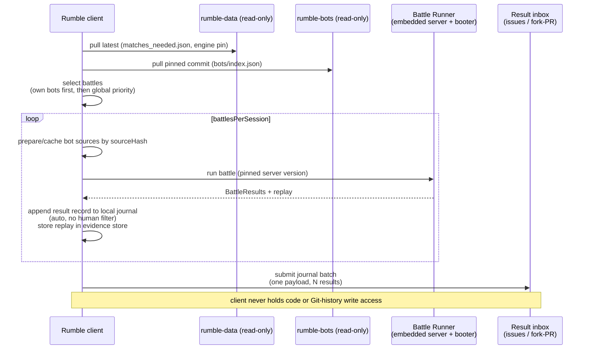
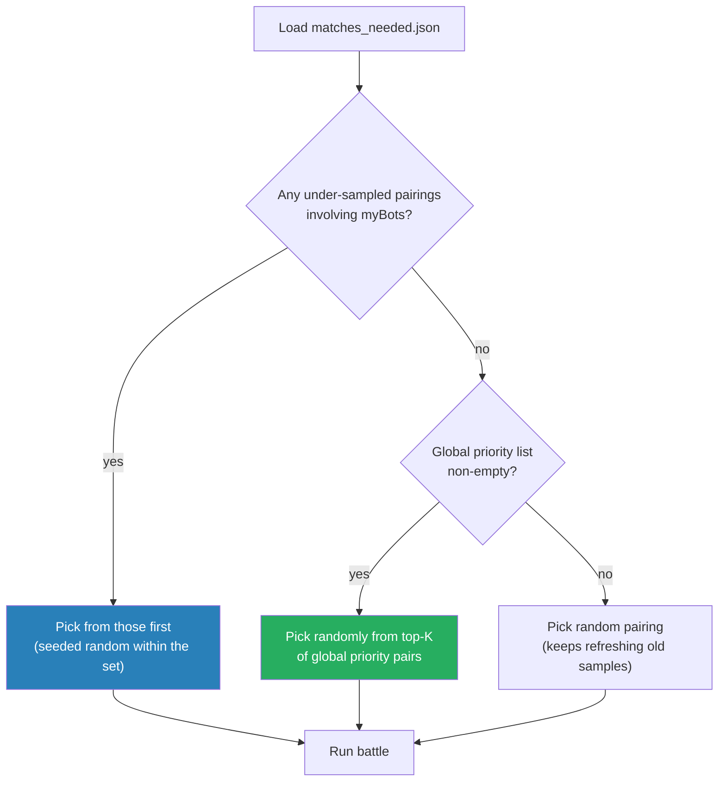

# Rumble Design: Client Battles and Result Upload

> **Status: DRAFT** - design direction captured.
> Part of the [Tank Royale Rumble umbrella design](./README.md).

## Scope

The rumble client: the program community members run on their own machines to fight battles and
submit results. Covers battle selection (including own-bot priority), execution, the result
record, submission transports, and the trust model as seen from the client side. Server-side
validation and ranking live in the [aggregation document](./aggregation-and-dashboard.md).

## Client Architecture

The client is a thin wrapper around the existing **Battle Runner** module (`runner/`), which
already provides embedded server lifecycle, bot process management, identity matching by
name+version, multi-battle reuse, and `BattleResults`. The client adds: repo sync, battle
selection, result transcription, and submission.

Configured by a single `rumble-client.json`:

```json
{
  "schemaVersion": 1,
  "botsRepo": "https://github.com/<org>/rumble-bots",
  "dataRepo": "https://github.com/<org>/rumble-data",
  "clientId": "flemming-desktop-01",
  "myBots": ["Raven"],
  "gameTypes": ["1v1", "twinduel", "melee"],
  "battlesPerSession": 50,
  "mode": "ranked"
}
```

The repo URLs are the only coupling to a forge. Migration or fork adoption is a config edit, and
the data repo carries a `wellknown/rumble.json` pointer file that clients follow automatically if
the canonical location moves (see the aggregation document).

## Modes: Ranked vs. Practice

The client has two strictly separated modes:

| | Ranked | Practice |
|---|--------|----------|
| Purpose | Contribute to the rumble | Tune, tweak, and debug your own bot against rumble bots |
| Opponents | Chosen by battle selection (below) | Chosen freely by the user |
| Own bot version | Only the version published in `rumble-bots` (pinned commit, verified by `sourceHash`) | Any local bot directory, including unpublished dev versions |
| Results | **Every** result auto-submitted, no filter | **Nothing** is ever submitted; output clearly labeled `PRACTICE - local only` |
| Engine | Pinned version enforced | Pinned version recommended (so tuning matches ranked conditions), not enforced |

Practice mode is a trust feature as much as a convenience: authors need a sanctioned way to run
private battles while developing. Without it, the pressure to "test privately" would push people
to tamper with ranked mode or submit selectively. With it, the rule stays simple and enforceable:
ranked mode submits everything, practice mode submits nothing.

## The Client Loop



In ranked mode, every finished battle is appended to a local **journal** automatically; the user
never gets a convenient "keep this result?" decision point (this matters for the trust model
below). The journal is then submitted in **batches**, not one payload per battle.

### Journal and batch submission (client-side Git usage)

Clients do not commit to any shared Git repository, and they never amend or rewrite anything (the
data repo's history is the audit trail; amending is reserved for nothing). The local flow is:

1. Each battle appends one result record to the current journal file (plain JSON lines, local).
2. At a batch boundary (session end, every N battles, or every M minutes, whichever comes first)
   the client submits the whole journal as **one** payload (one issue / one fork-PR commit).
3. On acknowledgment the journal rolls over; on failure it stays queued and retries with backoff.

Batching cuts forge API calls and inbox noise by an order of magnitude and plays well with rate
limits. The server side is unchanged: the ingestion workflow drains payloads (each containing one
or many results), validates each result individually, and lands the whole drain as a single
commit (see the aggregation document).

## Battle Selection and Own-Bot Priority

The client prioritizes the user's own bots first. This is the classic RoboRumble incentive and it
worked for two decades: the fastest way to get *your* new bot ranked is to run a client yourself.
The selection algorithm:



Why the seeded randomness: many clients read the same `matches_needed.json` (it is advice, not a
reservation, principle P6). Random choice from the top-K spreads clients across the priority list;
collisions just produce extra samples, which are welcome.

### Does own-bot priority bias the ranking?

This needs to be split into two different effects:

1. **Run-selection bias: harmless.** Choosing *which* pairings to run more often does not bias
   APS, because APS averages the per-pairing means, and every battle of a pairing is submitted.
   More samples of your own pairings only makes *your* score converge faster.
2. **Selective reporting: the real risk.** An author could run battles locally and submit only the
   wins. Mitigations:
   - The client auto-submits every result (no manual filter in the tool). This only raises the
     effort bar, it cannot stop a determined cheater, so:
   - The aggregation side marks pairings where every sample comes from clients owned by one of the
     participants as **self-reported-only**, and keeps them in the priority list until at least
     one independent client has contributed. Self-confirmed results count provisionally; the
     dashboard can show the marker.
   - Cross-client outlier detection (aggregation document) flags clients whose results deviate
     systematically from consensus on shared pairings.

This turns the motivation question and the trust question into one mechanism: your own battles get
you on the board fast (motivation), and the crowd confirms you (trust).

## Do We Trust Results From a Client?

Short answer: **trust by default, verify statistically, keep an audit trail.** The threat is fake
or corrupted results, which is a bigger practical risk than malicious bot code.

| Layer | Mechanism | Cost |
|-------|-----------|------|
| Identity | The forge account that opens the result issue / fork-PR **is** the identity. Client signing is deferred from v1. | Free |
| Plausibility | Server-side validation: schema, `behaviorVersion` matches the pin, scores consistent with rounds and ranks, known bot versions, duplicate hash detection. | Script |
| Consensus | With dozens of clients, most pairings get samples from several submitters. Per-client deviation from pairing consensus is computed; outliers are flagged in a report for moderators, and a client can be quarantined (its results excluded by the pure recompute, since facts are never deleted). | Script |
| Self-report marker | Pairings sampled only by a participant's owner stay "unconfirmed" until an independent client contributes (see above). | Script |
| Evidence | Each battle has a `battleId` (UUID) binding the result record to a locally kept, read-only `.battle.gz` replay whose SHA-256 is in the record. Moderators can request the replay for a disputed result. Spot-check, not universal verification. See "Replay evidence store" below. | Optional |
| Signing | Client keypairs and signed results are deferred: they add onboarding friction, while the layers above reproduce the RoboRumble trust model that historically sufficed. Revisit if abuse appears. | Deferred |

## The Result Record

One immutable JSON file per battle. Participant fields map 1:1 onto the existing
`results-for-observer` schema, so transcription from `BattleResults` is mechanical.

```json
{
  "schemaVersion": 1,
  "battleId": "8f14e45f-ea0a-4c1d-9b3a-2d7c6a1e5b09",
  "gameType": "1v1",
  "timestamp": "2026-07-02T14:03:22Z",
  "client": { "id": "flemming-desktop-01", "version": "0.3.0" },
  "engine": { "behaviorVersion": 7, "serverVersion": "1.1.4", "runnerVersion": "1.1.4" },
  "botsRepoCommit": "08940d5",
  "rounds": 35,
  "participants": [
    { "name": "Raven", "version": "2.1", "sourceHash": "sha256:a1b2c3...",
      "rank": 1, "totalScore": 4820, "survival": 1200, "lastSurvivorBonus": 150,
      "bulletDamage": 2900, "bulletKillBonus": 320, "ramDamage": 50, "ramKillBonus": 0,
      "firstPlaces": 22, "secondPlaces": 13, "thirdPlaces": 0 },
    { "name": "Corners", "version": "1.0", "sourceHash": "sha256:d4e5f6...",
      "rank": 2, "totalScore": 2110, "survival": 400, "lastSurvivorBonus": 0,
      "bulletDamage": 1500, "bulletKillBonus": 110, "ramDamage": 100, "ramKillBonus": 0,
      "firstPlaces": 13, "secondPlaces": 22, "thirdPlaces": 0 }
  ],
  "replayHash": "sha256:..."
}
```

Score shares (APS input) are always derived (`totalScore / sum(totalScore)`), never stored, so a
record cannot be internally inconsistent about them.

### Replay evidence store

Replays are the proof behind a result, and they stay **client-side** (uploading them to the data
repo would bloat it with binaries and strain forge storage; results are small text, replays are
not). Binding and handling:

- The client generates a `battleId` (UUID) per battle. It appears in the result record, and the
  replay is stored as `evidence/<battleId>.battle.gz`.
- The record also carries `replayHash` (SHA-256 of the replay file). The UUID makes lookup
  trivial; the hash makes the binding tamper-evident, since a replay edited after the fact no
  longer matches the submitted hash.
- The client marks replay files **read-only** after writing and tells the user plainly: these
  files are your evidence for submitted results; keep them.
- **Backups are the user's responsibility**, and the client actively encourages them: the
  documentation states it, the client prints a reminder with the evidence directory path at the
  end of each ranked session, and the evidence store is a single self-contained directory
  precisely so that backing it up is one copy command. The rumble never holds replays centrally
  (see the aggregation document's Terms of Service section), so lost evidence cannot be recovered
  from anywhere else.
- Retention: keep a replay at least until its pairing is independently confirmed (see the
  aggregation document), with a suggested minimum of 90 days. The client prunes expired replays
  and reports what it pruned.

## Submission Transports (No Repository Write Access)

The client must not hold a token that can write code, branches, releases, packages, Pages
content, or result projections in any repo (P3, P4). Two transports, both funneling into the same
server-side validator:

| Transport | How | Trade-offs |
|-----------|-----|-----------|
| **Issue-ops (primary)** | Client opens an issue on `rumble-data` with the result JSON in the body, using a fine-grained token with Issues write permission limited to that repository. GitHub does not expose a narrower create-issue-only permission. A scheduled workflow drains all open result issues in one pass and commits them in a single batch. | Lowest friction; issues exist on GitHub, GitLab, and Forgejo/Gitea; the token cannot tamper with code or leaderboard. Issue bodies are transport, not state (fine to lose on fork). |
| **Fork-PR (fallback)** | Client pushes result files to its own fork and opens a PR; CI validates and auto-merges on green. | Pure Git, survives any forge unchanged; heavier per submission; useful as the portability escape hatch. |

Rejected: `repository_dispatch` (needs a repo-scoped token on every client, exactly the credential
we forbid, and forge-proprietary); webhooks into serverless functions (infrastructure, secrets,
lock-in, violates P1/P3).

Conflict-freedom comes from content-addressed filenames, never coordination:
`results/raw/<year>/<month>/<utc-timestamp>-<clientId>-<payload-hash-prefix>.json`.

## Engine Pinning and Version Rollout

Tank Royale releases all artifacts in **lockstep** (one release version for server, booter, GUI,
recorder, runner, Bot APIs). That is the right model for the product, but it means a release
version bump signals "something in the suite changed", not "the game changed": a GUI-only
feature release must not obsolete rumble clients or reset rankings. The rumble therefore pins a
second, dedicated axis:

**`behaviorVersion`**: a plain integer owned by the server, bumped **only** when game-observable
behavior changes, i.e. anything that could alter the outcome of a battle: server physics,
scoring, turn processing, RNG behavior, and Bot API changes that affect what bots do (event
dispatch fixes are the canonical example: patch-sized code changes that absolutely change battle
outcomes). It is reported in the server handshake, stamped into every result record, and pinned
in `rumble-data/engine.json`:

```json
{
  "schemaVersion": 1,
  "behaviorVersion": 7,
  "release": "1.1.4",
  "clientImage": "ghcr.io/<org>/rumble-client:1.1.4"
}
```

Semantics:

- **Compatibility is decided by `behaviorVersion`, never by the release version.** Any release
  that carries the pinned behavior version is acceptable; the client and the validator both
  compare the behavior version reported by the running server against the pin. A GUI-only
  release 1.2.0 with unchanged `behaviorVersion 7` causes no rollout, no client obsolescence,
  and no epoch reset. `release`/`clientImage` in the pin are convenience ("which build to
  install"), not the compatibility contract.
- **A `behaviorVersion` bump is the rollout event.** All clients become obsolete at that moment,
  by design: mixed behavior versions would silently corrupt result comparability. On its next
  sync the client sees the new pin, refuses ranked mode, and prints exactly how to upgrade.
  Results produced on the old behavior version are rejected by the validator (and the client
  will not submit them). Each behavior version is its own result **epoch** (aggregation
  document).
- **Bump discipline is guarded, not trusted.** The engine's CI replays recorded battles
  deterministically and compares outcomes: an unintended outcome difference fails the build, and
  an intended one requires bumping `behaviorVersion` in the same change. The Tank Royale
  preparation proposal defines the hook for this guard; the replay corpus can be expanded in a
  later proposal.
- Upgrading must be **one step**: `docker pull` the image named in the new pin for container
  users, or re-running the platform install script for bare-metal users.

## Runtimes: the Client Container and Install Scripts

A rumble client must be able to boot bots for **all four platforms**: Java (JVM), C# (.NET),
Python, and TypeScript (Node.js). Requiring users to hand-assemble four runtimes is a
participation killer, so the primary distribution is a container image:

- **`rumble-client` image**: bundles the pinned server, booter, runner, the rumble client itself,
  plus the exact runtime versions (JRE, .NET SDK, Python, Node.js/npm) matching the engine pin.
  Tagged by release version (`rumble-client:1.1.4`, the image named in `engine.json`), so
  upgrading engine and runtimes is one pull; the pinned image implies the pinned
  `behaviorVersion`.
- The image doubles as the **sandbox**: run with no outbound network (localhost WebSocket only)
  except the submission endpoint, and CPU/memory/time limits via container flags. Review reduces
  malice (submission document), the container contains it; no one pretends there is a central
  sandbox.
- The `Dockerfile` lives in the repo, so forks can rebuild the image even though registry
  packages (GHCR) do not fork with the repo (principle P2 is satisfied by rebuildability, not by
  the artifact).
- **Bare-metal fallback**: documented install scripts per OS (Linux, macOS, Windows) that check
  for and install the required runtime versions and the pinned engine artifacts. Bare-metal users
  knowingly accept the residual risk of running reviewed-but-untrusted code outside a container.

## Client Policy Details

- **Battles per pairing per client cap: none, matching the classic rumble.** Saturation is
  handled by the priority mechanism alone. Once everything is saturated, extra battles are
  harmless by design because per-pairing averaging refines the mean without changing the pairing
  weight.
- **`myBots` is purely a local scheduling hint.** No verification happens in the client.
  Ownership is verified where it matters: at bot upload time, where the bot name is bound to the
  owner account. The server-side self-report marker handles trust.
- **Journal staleness is bounded by the engine pin.** Queued results produced on a
  `behaviorVersion` other than the currently pinned one are incompatible and are dropped with a
  clear message. No separate staleness clock is needed.
- **Submission happens at battle boundaries.** A result exists only when a battle has completed
  its game type's full round count; nothing is submitted mid-battle. The
  default is to submit after each completed battle, with batching used when submissions back up or
  rate limits require it.
- **Container network policy: egress allowlist.** The container may reach the forge for repo sync
  and result submission and nothing else. Bot processes get no network beyond the localhost
  WebSocket to the server.
