# Rumble Design: User Documentation and Onboarding

> **Status: DRAFT** - exploration phase, no decisions made.
> Part of the [Tank Royale Rumble umbrella design](./README.md).

## Scope

The documentation the rumble ships for its users: what documents exist, who they serve, where
they live, and the onboarding journeys they support. The other design documents describe how the
system works; this one describes how a person finds out what to do. Documentation is
participation infrastructure: every workflow that lacks a guide costs participants, and the
rumble's health is measured in participants.

## Principles Applied to Docs

- **Docs fork with the system (P2).** All user documentation is plain Markdown inside the two
  repositories, rendered by the forge. No external wiki, no separate docs host, no build step.
  A fork gets the complete manual automatically, and docs stay versioned in lockstep with the
  behavior they describe.
- **Docs live in the repo they govern.** Bot-author docs live in `rumble-bots`; client and
  submitter docs live in `rumble-data`. The dashboard is the single public entry point and links
  to both.
- **Task-oriented quickstarts first, reference second.** Each audience gets one "do this now"
  path with copy-paste commands; background and policy are linked, not inlined.

## Audiences and Their Journeys

Three audiences, three journeys. Each journey below is also the table of contents of that
audience's quickstart.

```mermaid
flowchart TD
    subgraph authorJ["Bot author"]
        A1["Read bot-author quickstart"] --> A2["Develop bot with official Bot API<br/>(practice mode against rumble bots)"]
        A2 --> A3["Declare license (SPDX field)"]
        A3 --> A4["Open PR to rumble-bots"]
        A4 --> A5["Fix validation findings,<br/>pass moderator review"]
        A5 --> A6["Merged: name reserved,<br/>bot enters matchmaking"]
        A6 --> A7["Watch ranking converge<br/>(run a client for priority)"]
    end

    subgraph runnerJ["Battle contributor"]
        B1["Read client quickstart"] --> B2["Pull client container<br/>(or run install script)"]
        B2 --> B3["One-time onboarding PR<br/>(register forge account + client id)"]
        B3 --> B4["Configure rumble-client.json"]
        B4 --> B5["Run ranked mode;<br/>results submit automatically"]
        B5 --> B6["Back up evidence directory"]
    end

    subgraph modJ["Moderator"]
        C1["Read moderator handbook"] --> C2["Review submissions<br/>(checklist + flagged findings)"]
        C2 --> C3["Handle name flags, disputes,<br/>quarantine, bans"]
        C3 --> C4["Operations runbook<br/>(cron re-enable, fork drill, compaction)"]
    end

    style A6 fill:#27AE60,color:#fff
    style B5 fill:#27AE60,color:#fff
    style C4 fill:#2980B9,color:#fff
```

## The Document Set

| Document | Audience | Lives in | Content |
|----------|----------|----------|---------|
| `README.md` (bots repo) | Everyone | `rumble-bots` | What the rumble is, links to every quickstart, link to dashboard |
| `docs/bot-author-guide.md` | Bot authors | `rumble-bots` | Quickstart: first bot from template to merged PR; practice mode; versioning rules; slots; license how-to |
| `CONTRIBUTING.md` | Bot authors | `rumble-bots` | Submission rules in full: booter convention, validation checks, SPDX field binding statement, DCO-style responsibility, review expectations |
| `GOVERNANCE.md` | Everyone | `rumble-bots` | Moderator team and rotation, bans and appeals, name disputes, lost-account adjudication |
| `docs/client-guide.md` | Battle contributors | `rumble-data` | Quickstart: container pull or install script, onboarding PR, configuration, ranked vs. practice, evidence backups, upgrading on engine bumps |
| `docs/onboarding.md` | Battle contributors | `rumble-data` | The one-time registration PR: what to add under `clients/`, what the token needs, what happens next |
| `docs/moderator-handbook.md` | Moderators | `rumble-data` | Review checklists, quarantine and ban procedures, spam handling, operations runbook (cron re-enablement, compaction, fork drill) |
| `docs/faq.md` | Everyone | `rumble-data` | Rankings explained (APS and friends), "why is my bot not ranked yet", troubleshooting, ToS posture |
| Dashboard "Participate" page | Everyone | `rumble-data/site` | Static entry page linking every document above; the only doc that lives on the Pages site itself |

Notes:

- The moderator handbook doubles as the **bus-factor runbook** (P8): everything a successor needs
  is a document, not tribal knowledge. The quarterly fork drill includes following the docs
  cold, which keeps them honest.
- The FAQ owns the explanations that would otherwise be repeated in issues: what APS means, how
  long until a new bot is ranked, why results were rejected, what an epoch reset is.
- Error messages link into the docs: every validation rejection and client refusal (engine-pin
  mismatch, unregistered account, license missing) carries the URL of the section that resolves
  it. Documentation nobody can find might as well not exist; error messages are where users
  actually are.

## Onboarding Friction Budget

The two journeys that must stay short, measured in steps a newcomer performs:

| Journey | Steps | Where it can go wrong |
|---------|-------|----------------------|
| First bot submitted | copy template, write bot, set license field, open PR | Validation failures must be self-explanatory; the guide shows the exact commands to run `validate_bot.py` locally first |
| First battle contributed | pull container, onboarding PR, paste config, run | The onboarding PR is the one human-gated step (spam defense, aggregation document); its template must make review a 30-second approval |

Anything that grows these lists needs a corresponding cut elsewhere; the friction budget is a
review criterion for future design changes.

## Resolved in Review (2026-07-02)

1. **Template bots: yes.** `rumble-bots` ships a per-platform template bot directory (copy,
   rename, go) as the first step of the author quickstart, derived from the sample bots in the
   main Tank Royale repository.
2. **Scoring explanations live in the Rumble FAQ.** The dashboard links metric column headers to
   the FAQ's explanations rather than maintaining its own tooltip machinery; one place to keep
   correct, no drift between site and docs.
3. **All rumble documentation follows the Tank Royale version.** The engine pin is already the
   version heartbeat of the whole system (epochs, client compatibility, container tags), so the
   docs join it: both repos are **tagged at every engine pin change**, the docs always describe
   the currently pinned engine, and anyone arriving from an old link reads the docs for the old
   engine via the matching tag. No per-section "as of engine 1.2" markers needed; the repo tag
   is the marker for everything at once.

## Open Questions

None currently.
