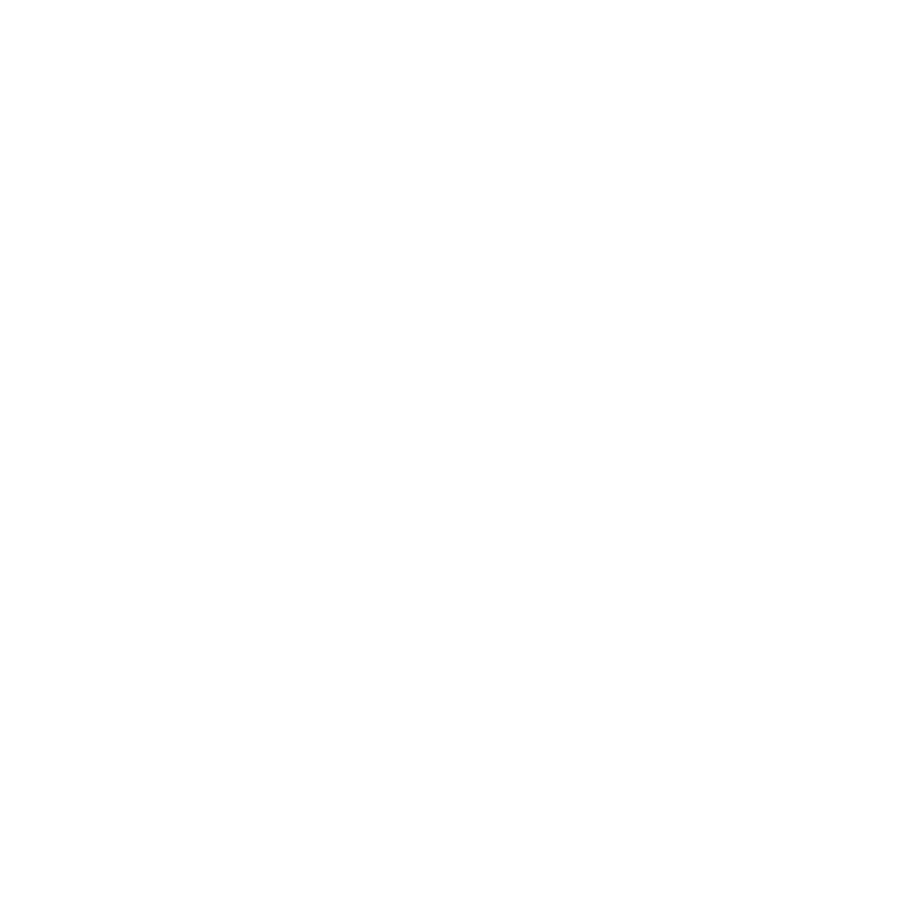

# Anatomy

A bot consists of three individual parts:
- Body
- Gun
- Radar

## Body

The body carries the gun with the radar on top. The body is moving the bot forward and back, as well as turning left or
right.

## Gun

The gun is mounted on the body and is firing energy bullets. The gun can turn left or right.

## Radar

The radar is mounted on top of the gun and is scanning for other bots when turned. The radar can turn left or right.
The radar is only scanning and detecting bots when while turning. And it is only able to scan bots that are within the
radar sweep.

## Radar sweep

The radar sweep is a pie shape that starts from the center of the bot and has a fixed radius of 1200 units.

Two angles
define the sides of the pie shape of the radar:
- **Start angle**: The current angle of the radar.
- **End angle**: The angle of the radar from the previous turn.
