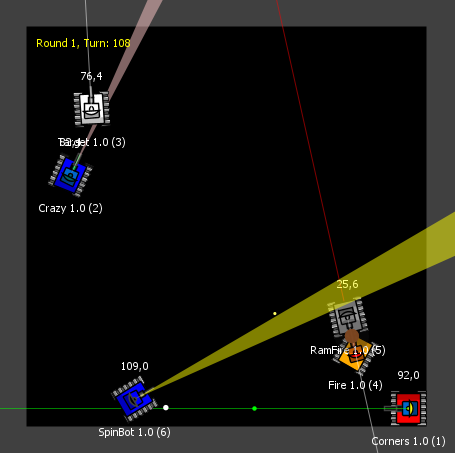

# What is Robocode?

Robocode is a [programming game](https://en.wikipedia.org/wiki/Programming_game) where the goal is to *code a robot* to
compete against other robots in a virtual battle arena. The player is the programmer of the robot, who will have no
direct influence on the game. Instead, the player must write a program for the brain of the robot. This program is
telling it how to behave and react to events occurring in the battle arena. So the name Robocode is a short term for
"Robot code."
Note that sometimes we use the shorter term "bot" instead of "robot," which means the same thing in Robocode.

The game is designed to help you learn how to program and improve your programming skills and have fun while doing it.
Robocode is also useful when studying or improving [machine learning](https://en.wikipedia.org/wiki/Machine_learning)
in a fast-running real-time game.

Robocode's battles take place on a battlefield, where small automated tank robots fight it out until only one is left.
Please notice that Robocode contains no gore, no blood, no people, and no politics. The battles are simply for the
excitement of the competition that we love so much.

### Screenshot of a Robocode battle

