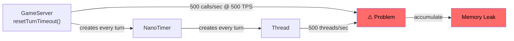
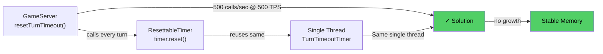
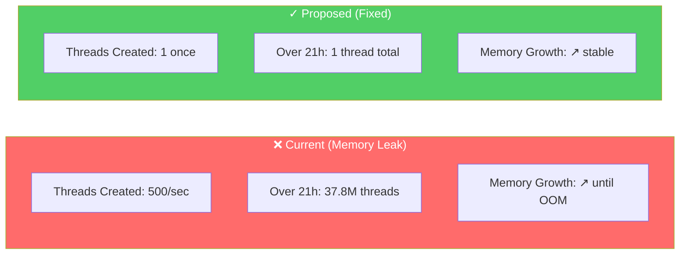
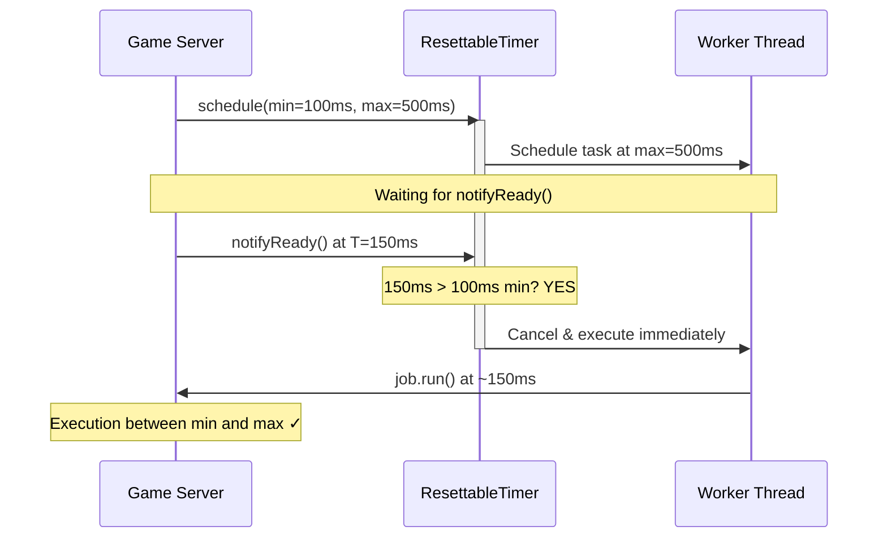

# Design: NanoTimer Thread Reuse

## Current Architecture



## Proposed Architecture



## Implementation Options

### Option 1: ScheduledExecutorService (Recommended)

Use `Executors.newSingleThreadScheduledExecutor()` with `schedule()` for delayed execution.

**Pros:**
- Standard Java/Kotlin concurrency API
- Built-in thread pooling and lifecycle management
- Well-tested, production-ready
- Supports cancellation via `ScheduledFuture`

**Cons:**
- Slightly different timing semantics (schedule-based vs spin-wait)
- May need adaptation for min/max period logic

**Implementation sketch:**
```kotlin
class ResettableTimer(private val job: Runnable) {
    private val executor = Executors.newSingleThreadScheduledExecutor { r ->
        Thread(r, "TurnTimeoutTimer").apply { isDaemon = true }
    }
    private var scheduledTask: ScheduledFuture<*>? = null
    
    fun schedule(minDelayNanos: Long, maxDelayNanos: Long) {
        cancel()
        // Schedule min-period task that waits for ready signal or max timeout
        scheduledTask = executor.schedule(job, maxDelayNanos, TimeUnit.NANOSECONDS)
    }
    
    fun cancel() {
        scheduledTask?.cancel(false)
    }
    
    fun shutdown() {
        executor.shutdownNow()
    }
}
```

### Option 2: Reusable Thread with State Reset

Keep a single thread alive and use `wait()`/`notify()` for coordination.

**Pros:**
- Closest to current behavior
- Fine-grained timing control

**Cons:**
- More complex synchronization
- Manual thread lifecycle management
- Harder to test and debug

### Option 3: Kotlin Coroutines

Use `delay()` with coroutine cancellation.

**Pros:**
- Lightweight, no thread-per-timer
- Natural Kotlin integration
- Structured concurrency

**Cons:**
- Adds coroutine dependency to server
- Different concurrency model than rest of codebase
- Learning curve for maintainers

## Recommendation

**Option 1: ScheduledExecutorService** is recommended because:

1. **Standard API**: Uses well-known Java concurrency primitives
2. **Minimal change**: Localizes changes to NanoTimer class
3. **Proven reliability**: ScheduledThreadPoolExecutor is battle-tested
4. **Simple shutdown**: Executor provides clean shutdown semantics
5. **Debuggability**: Named thread appears clearly in stack traces

### Impact Comparison



## Timing Semantics Preservation

Current `NanoTimer` has two-phase timing:
1. **Min period**: Wait at least this long before executing
2. **Max period**: Execute by this time even if not "ready"

With `notifyReady()`, execution can happen between min and max.



**Proposed approach:**
- Schedule initial task at `maxPeriodNanos`
- Track start time and check min period in task
- If `notifyReady()` called and min period elapsed, reschedule immediately
- Otherwise reschedule for remaining min period time

## Thread Naming

The single timer thread should be named `"TurnTimeoutTimer"` for easy identification in:
- Thread dumps
- Profilers
- Log messages
- Debugging sessions

## Shutdown Handling

```kotlin
fun shutdown() {
    executor.shutdown()
    if (!executor.awaitTermination(1, TimeUnit.SECONDS)) {
        executor.shutdownNow()
    }
}
```

Call from `GameServer.cleanupAfterGameStopped()` and `GameServer.stop()`.

## Testing Strategy

1. **Unit tests for ResettableTimer:**
   - Verify job executes after max delay if not notified
   - Verify job executes immediately on notify after min delay
   - Verify reset cancels pending execution
   - Verify shutdown stops all activity

2. **Integration tests:**
   - Run 1000+ turns and verify single thread in use
   - Memory profiling test (no thread count growth)
   - Timing accuracy tests at various TPS settings

3. **Long-running stability test:**
   - 24-hour battle at 500 TPS
   - Monitor heap usage stays flat
   - No OOM errors

