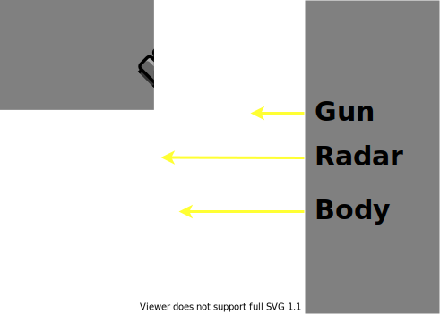

# Anatomy

A bot consists of three individual parts:

**Body**: Carries the gun with the radar on top. The body is used for moving the bot forward and back, as well as turning left or right.

**Gun**: Mounted on the body and is used for firing energy bullets. The gun can turn left or right. Carries the radar on top.

**Radar**: Mounted on the gun and is used to scan for other bots when moved. The radar can turn left or right. When the radar is turned it will scan and detect bots when is within the radar sweep.

## Radar sweep

The radar sweep is a pie shape starting from the centre of the bot and has a radius of 1200 units. The sides of the pie shape are defined by the angle of the radar in the last turn and the current angle of the radar in this turn.

