# Schemas

This directory contains the schema of the protocol used by Robocode Tank Royale for network communication.

## Joining and leaving the server

Handshakes are used between a client (bot, observer, controller) and the server to exchange metadata about the clients
and server and to notify the server when a client wants to join the server.

When a client opens a WebSocket connection with the server, the server will send a _server-handshake_
message to the client with information about the server. Then, if the client wants to join the server, it must send a
handshake to the server. The handshake from the client depends on the client type.

### Bot joining

The bot handshake must be sent by a bot to join the server.

- [server-handshake]
- [bot-handshake]
- [bot-list-update]

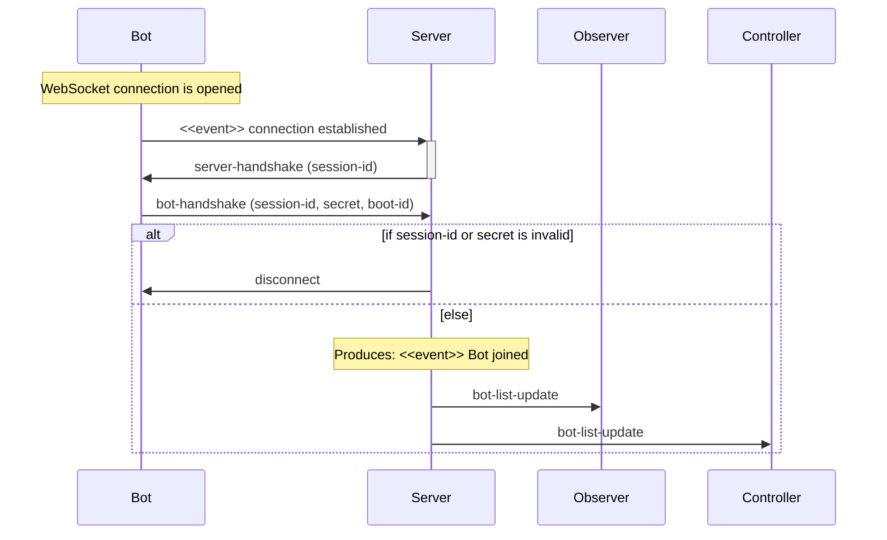

Note that the session-id sent to the bot via the `server-handshake` must be sent back to the server as identification.
If the server requires a secret, this must be passed as well.
A `boot-id` might be provided by the bot (via a Bot API) if it was booted from the Booter.

### Bot leaving

A bot will be leaving a server when it closes its connection to the server.

- [bot-list-update]

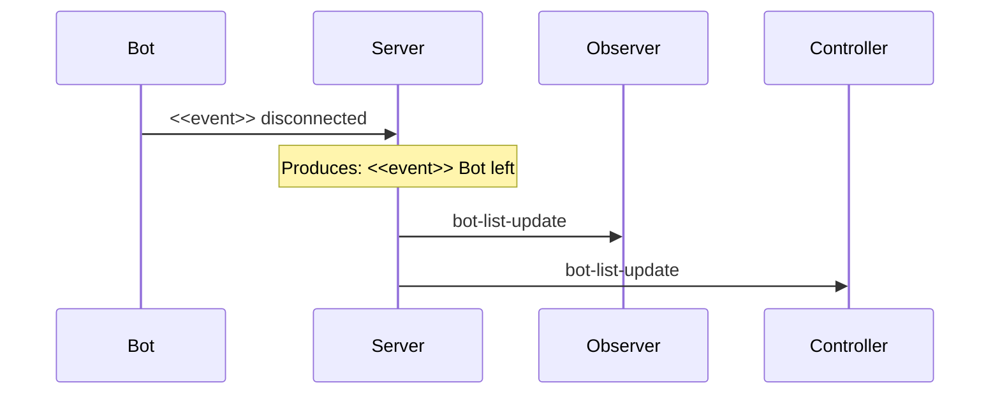

### Observer joining

The observer handshake must be sent by an observer to join the server.

- [server-handshake]
- [observer-handshake]

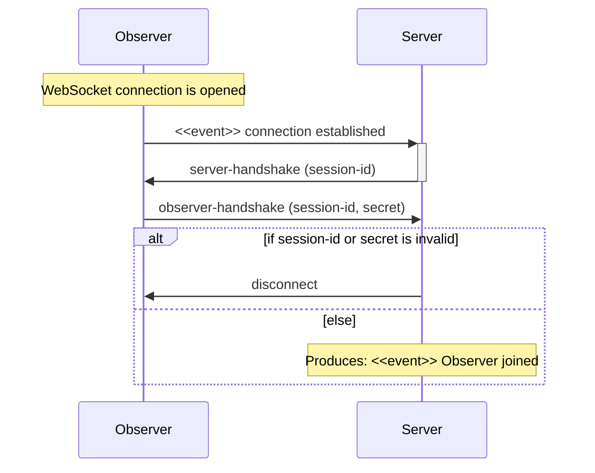

Note that the session-id sent to the observer via the `server-handshake` must be sent back to the server as
identification. If the server requires a secret, this must be passed as well.

### Controller joining

The controller handshake must be sent by a controller to join the server.

- [server-handshake]
- [controller-handshake]

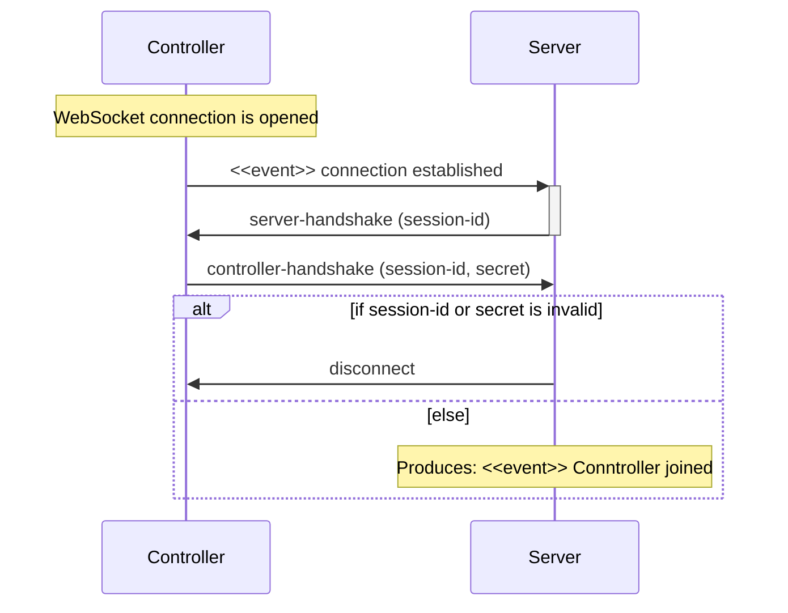

Note that the session-id sent to the controller via the `server-handshake` must be sent back to the server as
identification. If the server requires a secret, this must be passed as well.

## Starting a game

The game is started from a controller, which sends a `start-game` message. The `start-game` message contains information
about which bots, selected by the controller, should participate in the battle. The server sends
a `game-started-event-for-bot` message to all selected bots and waits for a `bot-ready` message from each bot. If the
bot manages to respond with a `bot-ready` message, it will be a _participant_ of the battle.

Two things can happen. Either enough bots sends back a `bot-ready` event to reach the minimum number of required
participant for a battle (determined by the game rules), and the game will be started. Or the _Ready timer_ times out
and the game will check if there are enough participants to start the game.

When there are enough participants to start the battle, the server sends a `game-started-for-observer` message to all
observers and controllers and the game will be in _running_ state.

If there are not enough participants for the battle, the _Ready timer_ will time out, and the server returns to the
state where it waits for more bots to join the battle, and a controller will need to make a new attempt to start a game.

- [start-game]
- [game-started-event-for-bot]
- [bot-ready]

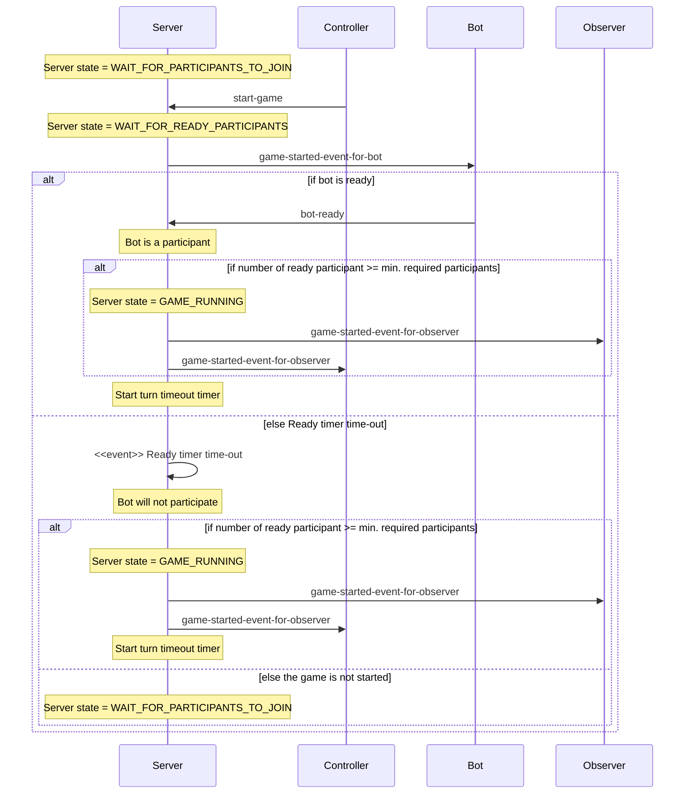

## Running next turn

Running the next turn is the main loop in the game. The server sends _tick events_ for all clients which contain the
current game state for the observers, and the bot state for the bots.

This is the crucial part for the bots, and these need to sent their _bot intent_ before the turn timeout occurs.

- [round-started-event]
- [round-ended-event-for-bot]
- [tick-event-for-bot]
- [tick-event-for-observer]
- [bot-intent]
- [skipped-turn-event]

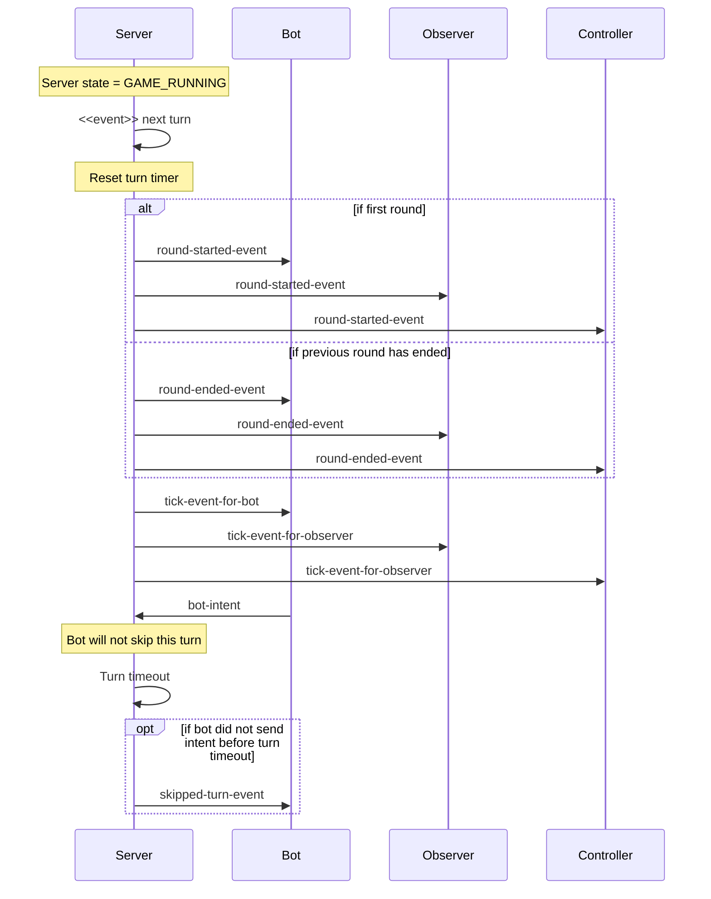

## Game is ending

The game is ended because a winner has been found, and results are available. An event is sent to the clients with the
results of the game.

- [game-ended-event-for-bot]
- [game-ended-event-for-observer]
- [won-round-event]

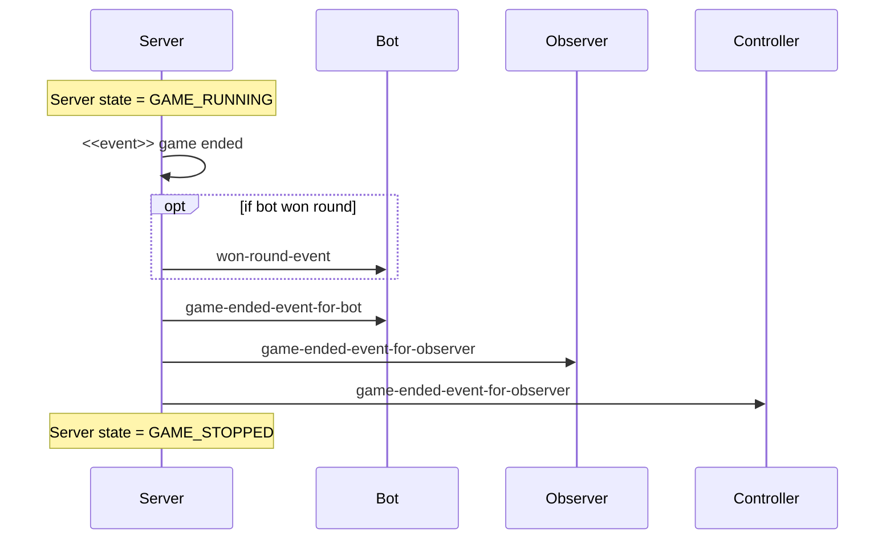

## Controlling the game

### Aborting a game

A controller can stop the game while it is running. No results will be available when the game was aborted.

- [stop-game]
- [game-aborted-event]

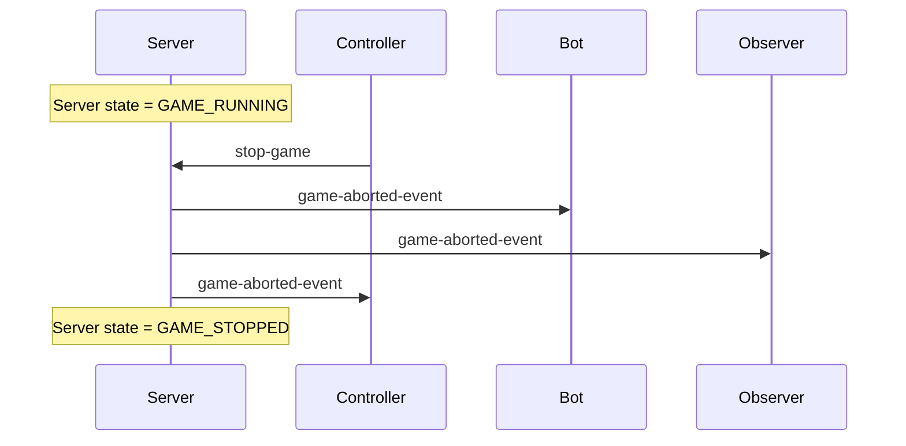

### Pausing a game

A controller can pause the game while it is running. The game will need to be resumed to continue. Note that the bots
are not being notified that the game is paused, but should see the game as running and the next turn to occur as usual.

- [pause-game]
- [game-paused-event-for-observer]

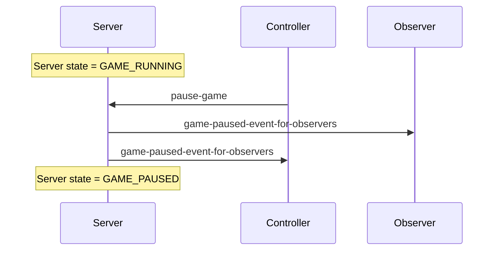

### Step to the next turn while being paused

A controller can tell the game to make the next turn while being paused. That is the next turn will be played as normal,
but the game will immediately be paused again after playing the next turn. This is used for single stepping while
debugging a bot, or just observe the game one turn/step at a time.

- [next-turn]

### Resuming a paused game

A controller is can resume the game from being paused.

- [resume-game]
- [game-resumed-event-for-observer]

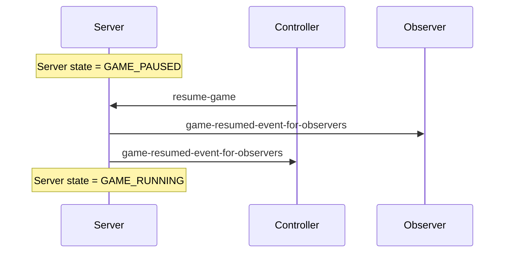

### Changing the TPS

A controller can change the [TPS] (Turns Per Second) for a battle.

- [change-tps]
- [tps-changed-event]

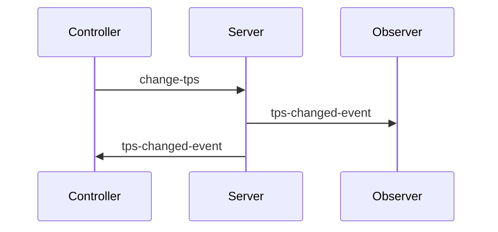

### In-game events

Here are the events that a bot receives under a game:

| Event                     | Description                                                                     |
|---------------------------|---------------------------------------------------------------------------------|
| [bot-death-event]         | When a bot dies                                                                 |
| [bot-hit-bot-event]       | When our bot collides with another bot                                          |
| [bot-hit-wall-event]      | When our bot collides with a wall                                               |
| [bullet-fired-event]      | When our bot fires a bullet                                                     |
| [bullet-hit-bullet-event] | When our bullet collided with another bullet                                    |
| [bullet-hit-wall-event]   | When our bullet has hit the wall                                                |
| [hit-by-bullet-event]     | When our bot has been hit by a bullet                                           |
| [scanned-bot-event]       | When our bot has scanned another bot                                            |
| [skipped-turn-event]      | When our bot skipped a turn (the intent was not received at the server in time) |
| [tick-event-for-bot]      | When a new turn is about to begin                                               |
| [won-round-event]         | When our bot won the round                                                      |

[TPS]: ../../docs/articles/tps.html "TPS (Turns Per Second)"

[server-handshake]: server-handshake.yaml

[bot-handshake]: bot-handshake.yaml

[observer-handshake]: observer-handshake.yaml

[controller-handshake]: controller-handshake.yaml

[bot-list-update]: bot-list-update.yaml

[start-game]: start-game.yaml

[game-started-event-for-bot]: game-started-event-for-bot.yaml

[bot-ready]: bot-ready.yaml

[round-started-event]: round-started-event.yaml

[round-ended-event-for-bot]: round-ended-event-for-bot.yaml

[tick-event-for-bot]: tick-event-for-bot.yaml

[tick-event-for-observer]: tick-event-for-observer.yaml

[bot-intent]: bot-intent.yaml

[skipped-turn-event]: skipped-turn-event.yaml

[game-ended-event-for-bot]: game-ended-event-for-bot.yaml

[game-ended-event-for-observer]: game-ended-event-for-observer.yaml

[won-round-event]: won-round-event.yaml

[stop-game]: stop-game.yaml

[game-aborted-event]: game-aborted-event.yaml

[pause-game]: pause-game.yaml

[next-turn]: next-turn.yaml

[game-paused-event-for-observer]: game-paused-event-for-observer.yaml

[resume-game]: resume-game.yaml

[game-resumed-event-for-observer]: game-resumed-event-for-observer.yaml

[change-tps]: change-tps.yaml

[tps-changed-event]: tps-changed-event.yaml

[bot-death-event]: bot-death-event.yaml

[bot-hit-bot-event]: bot-hit-bot-event.yaml

[bot-hit-wall-event]: bot-hit-wall-event.yaml

[bullet-fired-event]: bullet-fired-event.yaml

[bullet-hit-bot-event]: bullet-hit-bot-event.yaml

[bullet-hit-bullet-event]: bullet-hit-bullet-event.yaml

[bullet-hit-wall-event]: bullet-hit-wall-event.yaml

[hit-by-bullet-event]: hit-by-bullet-event.yaml

[scanned-bot-event]: scanned-bot-event.yaml

[skipped-turn-event]: skipped-turn-event.yaml

[tick-event-for-bot]: tick-event-for-bot.yaml

[won-round-event]: won-round-event.yaml