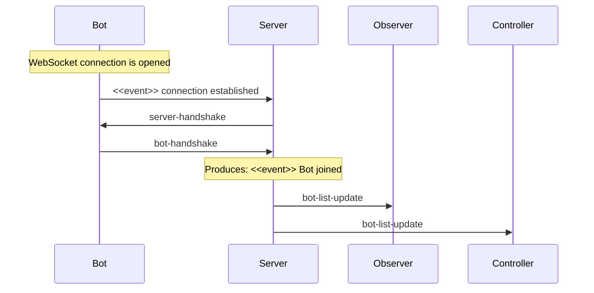
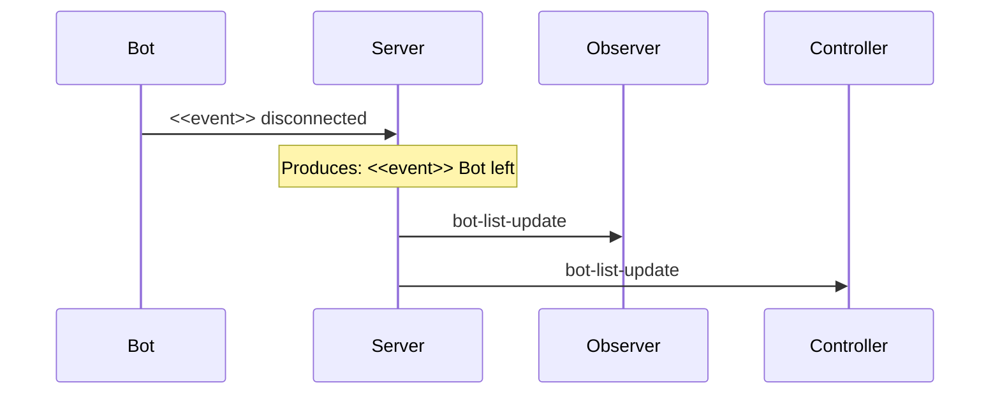
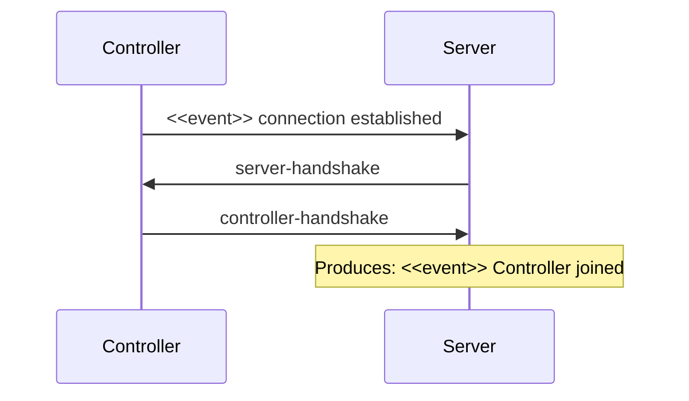
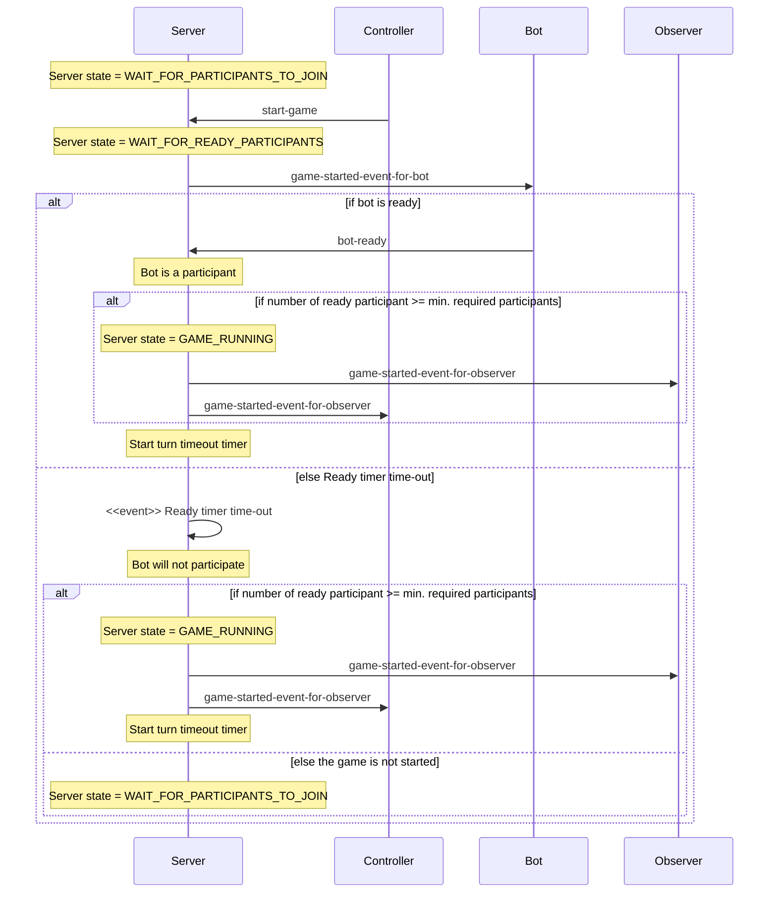
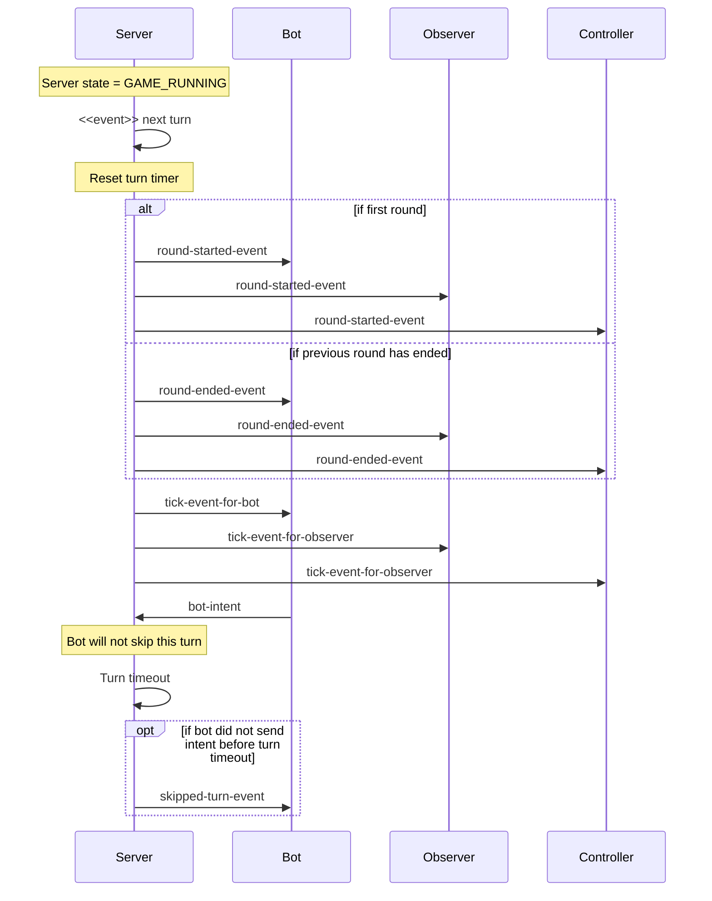
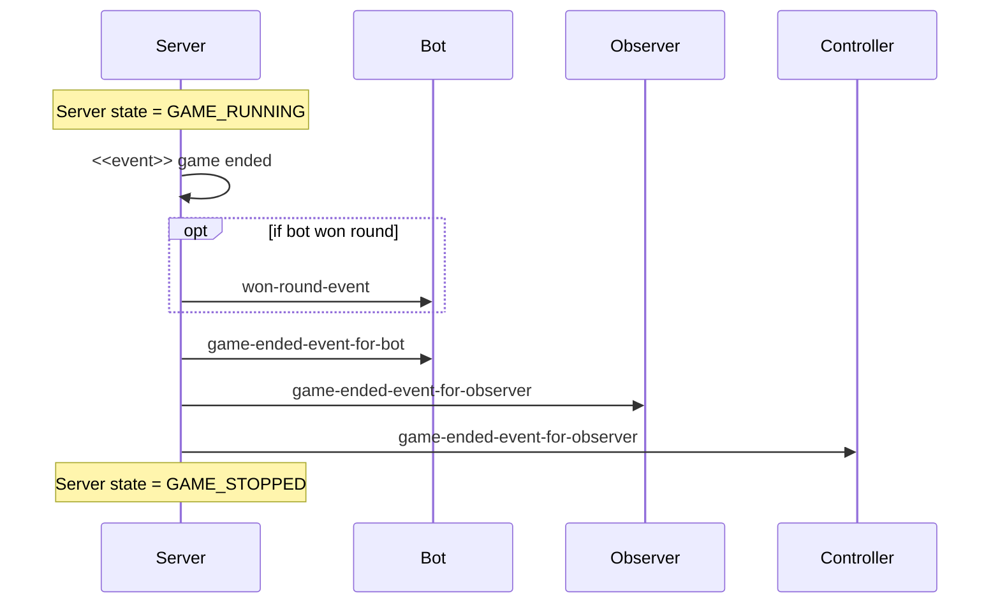
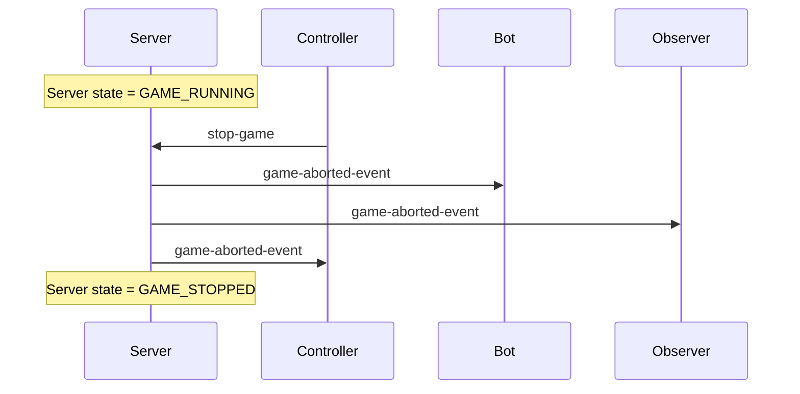
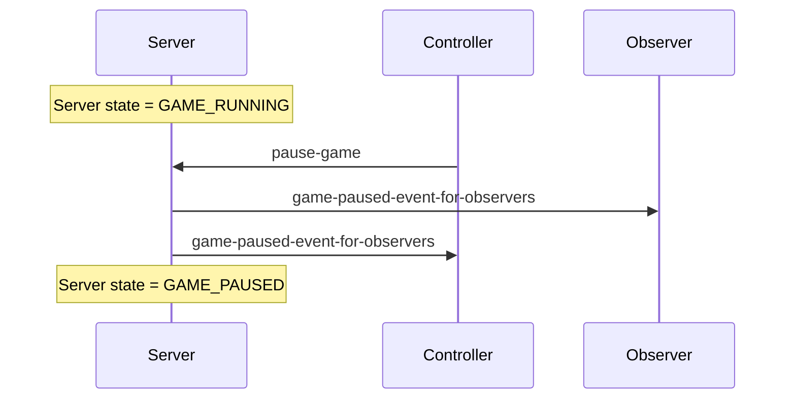
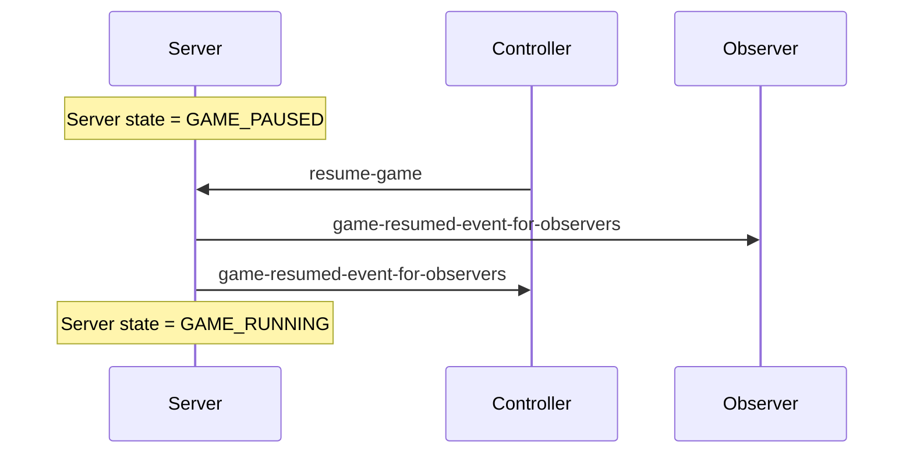
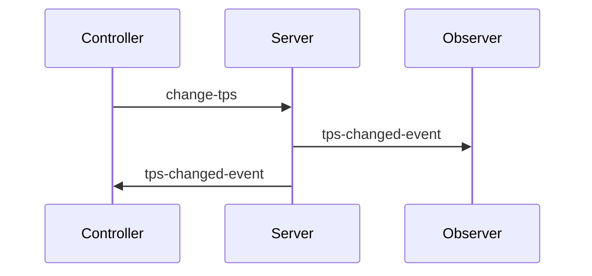

# Schemas

This directory contains the schema of the protocol used by Robocode Tank Royale for network communication.

## Joining and leaving server

Handshakes are used between a client (bot, observer, controller) and the server to exchange metadata about the clients
and server and to notify the server when a client wants to join the server.

Basically, when a client opens a WebSocket connection with the server, the server will send a _server-handshake_
message to the client with information about the server. Then, if the client wants to join the server, it must send a
handshake to the server. The handshake from the client depends on the client type.

### Bot joining

The bot handshake must be sent by a bot to join the server.

- [server-handshake.yaml]()
- [bot-handshake.yaml]()
- [bot-list-update.yaml]()

### Bot leaving

A bot will be leaving a server when it closes its connection to the server. 

- [bot-list-update.yaml]()

### Observer joining

The observer handshake must be sent by an observer to join the server.

- [server-handshake.yaml]()
- [observer-handshake.yaml]()

### Controller joining

The controller handshake must be sent by a controller to join the server.

- [server-handshake.yaml]()
- [controller-handshake.yaml]()

## Starting a game

The game is started from a controller, which sends a `start-game` message. The `start-game` message contains information
about which bots, selected by the controller, which should participate in the battle. The server sends
an `game-started-event-for-bot` message to all selected bots, and waits for a `bot-ready` message from each bot. If the
bot manage to respond with a `bot-ready` message, it will be a _participant_ of the battle.

Two things can happen. Either enough bots sends back a `bot-ready` event to reach the minimum number of required
participant for a battle (determined by the game rules), and the game will be started. Or the _Ready timer_ times out
and the game will check if there is enough participants to start the game.

When there is enough participants to start the battle, the server sends a `game-started-for-observer` message to all
observers and controllers, and the game will be in _running_ state.

If there is not enough participants for the battle, the _Ready timer_ will time out, and the server return to the state
where it waits for more bots to join the battle, and a controller will need to make a new attempt to start a game.

- [start-game.yaml]()
- [game-started-event-for-bot.yaml]()
- [bot-ready]()

## Running next turn

Running the next turn is the main loop in the game. The server sends _tick events_ for all clients which contains the
current game state for the observers, and the bot state for the bots.

This is the crucial part for the bots, and these need to sent their _bot intent_ before the turn timeout occurs.

- [round-started-event.yaml]()
- [round-ended-event.yaml]()
- [tick-event-for-bot.yaml]()
- [tick-event-for-observer.yaml]()
- [bot-intent.yaml]()
- [skipped-turn-event.yaml]()

## Game is ending

The game is ended because a winner has been found, and results are available. An event is sends to the clients with the
results of the game.

- [game-ended-event-for-bot.yaml]()
- [game-ended-event-for-observer.yaml]()
- [won-round-event.yaml]()

## Aborting a game

A controller is stopping the game while it is running. No results will be available when the game was aborted.

- [stop-game.yaml]()
- [game-aborted-event.yaml]()

## Pausing a game

A controller is pausing the game while it is running. The game will need to be resumed to continue. Note that the bots
are not being notified that the game is paused, but should see the game as running and the next turn to occur as usual.

- [pause-game.yaml]()
- [game-paused-event-for-observers.yaml]()

## Resuming a paused game

A controller is resuming the game from being paused.

- [resume-game.yaml]()
- [game-resumed-event-for-observers.yaml]()

## Changing the TPS

A controller can change the [TPS] (Turns Per Second) for a battle.

- [change-tps.yaml]()
- [tps-changed-event.yaml]()

[TPS]: ../../docs/docs/articles/tps.md "TPS (Turns Per Second)"