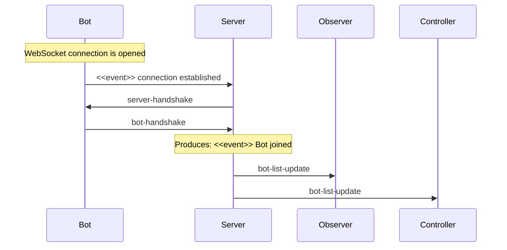
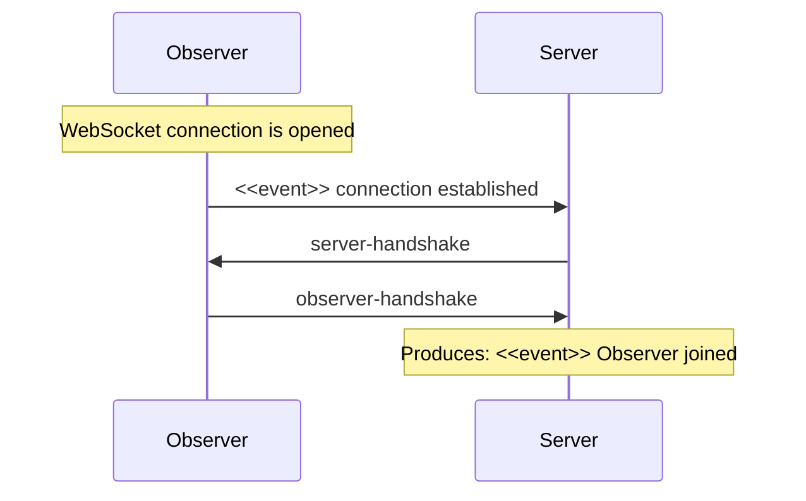
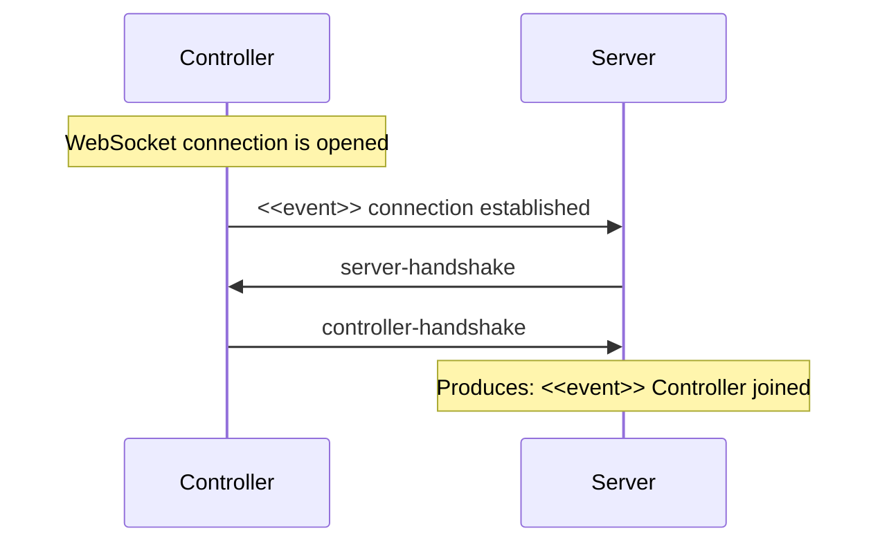

# Schemas

This directory contains the schema of the protocol used by Robocode Tank Royale for network communication.

## Handshakes

Handshakes are used between a client (bot, observer, controller) and the server to exchange metadata about the clients
and server and to notify the server when a client wants to join the server.

Basically, when a client opens a WebSocket connection with the server, the server will send a _server-handshake_
message to the client with information about the server. Then, if the client wants to join the server, it must send a
handshake to the server. The handshake from the client depends on the client type.

### Bot Handshake

- [server-handshake.yaml]()
- [bot-handshake.yaml]()
- [bot-list-update.yaml]()

### Observer Handshake

- [server-handshake.yaml]()
- [observer-handshake.yaml]()

### Controller Handshake

- [server-handshake.yaml]()
- [controller-handshake.yaml]()

